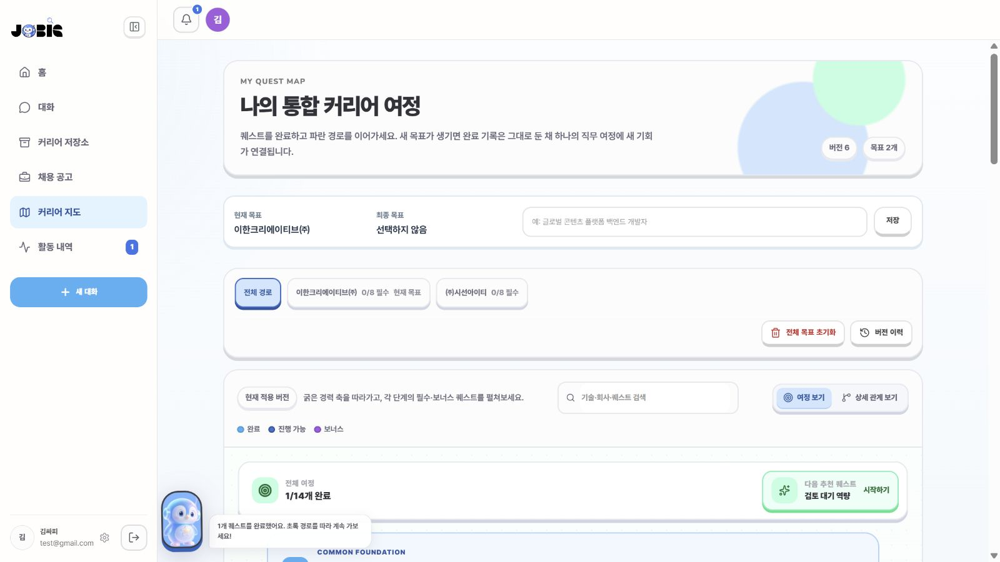
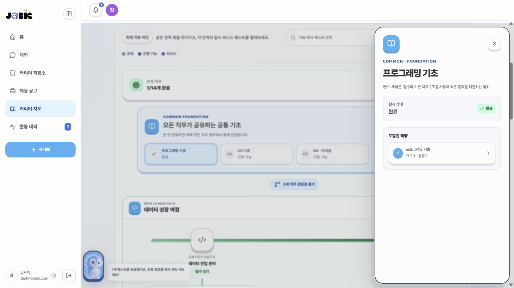
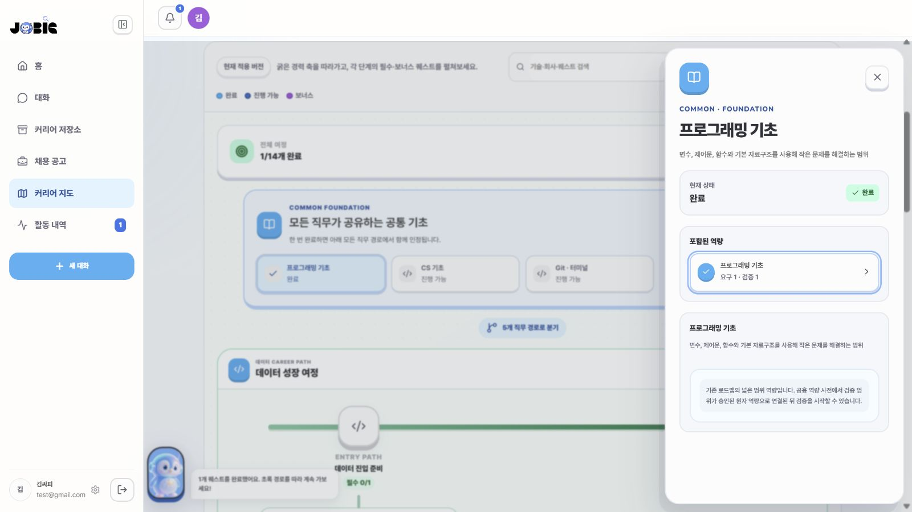

# JOBIS 취업 준비 로드맵 완성도 감사

감사일: 2026-08-09

## 범위

- 현재 적용된 8088 커리어 지도 버전 6의 개요
- 공통 기초 `프로그래밍 기초` 섹션과 세부 역량 흐름
- 로드맵 생성 계약, Capability Graph, 프론트 투영, 기존 학습 가이드 경계
- 사용자가 제안한 CS 기초와 프로그래밍 기초 자료의 적합성

## 화면 흐름

### 1. 로드맵 개요 — 부분 정상

- 목표 2개와 전체 진행률을 확인할 수 있다는 점은 좋다.
- 하지만 다음 추천이 `검토 대기 역량`이라는 시스템 상태를 그대로 노출한다.
- 직무별 분기와 회사 프로젝트는 보이지만, 왜 이 순서인지와 현재 사용자에게 무엇이 부족한지
  한눈에 설명하지 않는다.

### 2. 기초 섹션 상세 — 정보 부족

- 섹션 상태와 포함 역량은 확인할 수 있다.
- 학습자료, 직접 해볼 과제, 완료 기준, 목표 공고와의 연결 이유가 없다.
- 넓은 빈 공간이 남고 다음 행동이 없어서 상세 화면이 실제 준비를 돕지 못한다.

### 3. 역량 상세 — 사용자 진행 차단

- 잘못된 평가 버튼을 숨긴 것은 안전하다.
- `공용 역량 사전`, `원자 역량`은 내부 구현 용어이고 사용자가 무엇을 하면 되는지는 말하지 않는다.
- 완료 상태인데도 `요구 1 · 검증 1`과 검증 불가 안내가 함께 보여 완료 의미가 충돌한다.

## 런타임·코드 근거

- 현재 적용 지도: 버전 6, 노드 54개, 관계 37개.
- 역량 노드 48개 중 23개는 어떤 관계에도 연결되지 않았고 section membership도 없다.
- 역량 노드 11개는 provisional 상태다.
- 로드맵 snapshot에 출처 또는 학습자료를 가진 노드는 0개다.
- 프론트 어댑터는 membership이 없으면 `직무 기반 역량`, provisional이면 `검토 대기 역량`이라는
  일반 제목으로 대체한다.
- Capability Graph 릴리스에는 검증된 source URL과 source ID가 존재하지만 RoadmapOperation과
  snapshot에는 학습자료 필드가 없어 화면까지 전달되지 않는다.
- 기존 AI 학습 가이드 UI와 completion criteria 모델은 존재하지만 legacy 경로에만 열려 있고
  UNIFIED 로드맵에서는 사용하지 않는다.
- 현재 승인 그래프는 Java·Spring·게임 결제 백엔드 비중이 높아 현재 AI 3D·LLM Agent 목표를
  충분히 덮지 못한다. 그래프 밖 요구사항이 provisional과 일반 챕터로 누적된다.

## 자료 판단

- `WeareSoft/tech-interview`는 자료구조, 네트워크, 운영체제, 데이터베이스, 알고리즘,
  보안 등 면접 점검 범위를 제공하므로 `CS 기초`의 복습·면접 체크리스트로 적합하다.
  다만 강의형 커리큘럼이나 실습 평가를 대신하지는 않는다.
- `opentutorials.org`는 언어·WEB·데이터베이스·개발도구 등의 코스가 있어 프로그래밍 입문
  출처로 적합하다. 홈페이지 하나보다 목표 직무와 선택 언어에 맞는 개별 코스를 연결해야 한다.
- `roadmap.sh`는 역할별 로드맵, 토픽별 콘텐츠, 질문을 분리한다. JOBIS도 지도 노드와 학습 콘텐츠를
  별도 엔터티로 두되 연결 ID를 유지하는 구조를 참고할 수 있다.
- ESCO는 직업과 역량의 관계를, O*NET은 지식·기술·경험·직무 과제를 구분한다. JOBIS의
  `공고 -> 직무 -> 역량 -> 학습 -> 과제 -> 증거` 관계를 보강하는 참조 분류로 적합하다.

## 권장 제품 구조

`SECTION`은 큰 준비 영역이고, 그 아래 `LEARNING_UNIT`과 `RESOURCE`, `PRACTICE`,
`COMPLETION_RULE`, `EVIDENCE`를 둔다. 원자 역량 평가는 여러 완료 방법 중 하나로만 사용한다.

각 섹션은 다음 정보를 제공해야 한다.

1. 이 섹션이 목표 공고에 필요한 이유와 연결된 공고 문장
2. 현재 사용자 상태와 부족한 항목
3. 순서가 있는 학습 단위와 선수관계
4. 검증된 학습자료 링크
5. 직접 해볼 과제와 산출물
6. 완료 기준과 완료 방식
7. 완료 후 연결되는 프로젝트·지원 기회

완료 상태는 구분해서 표시한다.

- `자가 확인 완료`: 자료와 체크리스트를 보고 사용자가 준비됐다고 표시
- `근거 확인 완료`: 저장소, 문서, 결과물 등의 증거를 제출
- `평가 통과`: 원자 역량 평가 통과
- 섹션 완료: 필수 학습 단위의 완료 규칙을 만족해 계산

## 생성 품질 게이트

로드맵 초안을 사용자에게 보여 주기 전에 결정적 코드가 다음 조건을 검사해야 한다.

- 필수 역량 100%에 section membership 존재
- 필수 역량 100%가 공고 요구 또는 프로젝트와 연결
- 각 필수 학습 단위에 최소 1개 자료와 1개 완료 기준 존재
- `직무 기반 역량`, `검토 대기 역량` 같은 일반 제목을 주 경로에서 사용하지 않음
- 관계가 없는 필수 역량 0개
- provisional 비율이 기준을 넘으면 완성 로드맵이 아니라 `추가 검토 필요` 초안으로 표시
- 사용자 증거로 이미 충족된 역량과 새로 준비할 역량을 분리
- 예상 일정이 사용자의 주당 투자 시간과 지원 마감일 안에 들어오는지 확인

## 구현 우선순위

1. 공통 기초 섹션에 curated resource와 자가 확인 체크리스트를 추가한다.
2. UNIFIED 계약에 LearningUnit, Resource, Practice, CompletionRule을 추가하고 기존 학습 가이드
   UI를 공통 경로로 통합한다.
3. AI Engineer·ML·LLM·Computer Vision 그래프 릴리스를 추가해 provisional 비율을 줄인다.
4. 적용 전 coverage 품질 게이트를 추가한다.
5. 사용자 보유 증거, 목표 공고 가중치, 마감일과 주당 시간을 반영해 우선순위를 계산한다.

## 접근성 확인 한계

스크린샷에서는 상태 문구의 의미 충돌과 작은 보조 텍스트 위험을 확인했다. 키보드 이동,
focus trap, 스크린 리더 이름, 확대·반응형 동작은 이번 시각 감사만으로 확인하지 않았다.
