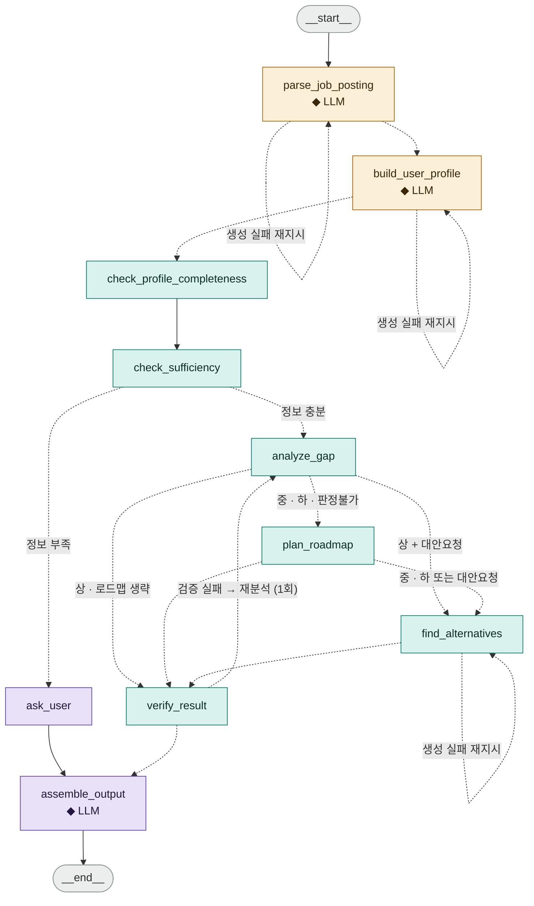

# AI 에이전트 흐름 · 역할 · 툴 · 입출력

`src/jobis_ai/graph/builder.py` 가 조립하는 **10개 노드와 6개 라우터**의 실제 구조.
모든 노드는 단일 `GraphState` 를 읽고 **부분 갱신 dict** 를 돌려준다.

> **핵심 원칙** — 판단·매칭·계산은 알고리즘(RAG/DB/룰/임베딩)이 하고, LLM은 **입구(읽기)와 출구(말하기)에만** 있다.
> 10개 노드 중 LLM을 호출하는 노드는 3개뿐이고, 나머지 7개는 전부 데이터가 돌린다.

| 계층 | 하는 일 | 허용 도구 | LLM |
|---|---|---|---|
| **① 읽기 (Read)** | 비정형 텍스트 → 정형 필드 (추출) | `extract_text`, `run_structured`, taxonomy | ✅ 읽기 용도만 |
| **② 판단 (Decide)** | 정형 데이터로 매칭·계산·검색·검증 (**결정**) | RAG, DB, 룰, 임베딩, 스케줄러 | ❌ **금지** |
| **③ 말하기 (Speak)** | 정형 결정 → 자연어 서술 (**표현**) | `nl_render` | ✅ 표현 용도만 |

---

## 1. 전체 그래프

**범례** — 🟠 읽기(Read) · 🟢 판단(Decide) · 🟣 말하기(Speak) · ◆ = LLM 호출
실선 = 고정 엣지, 점선 = 조건부 라우팅(`add_conditional_edges`)

---

## 2. 에이전트(노드)별 역할 · 사용 툴

> 판단 계층에 LLM이 새로 생기면 **설계 위반**이다. 이 표는 회귀 감시용으로도 쓴다.

| # | 노드 | 계층 | LLM | 역할 | 사용 툴 |
|---|---|---|---|---|---|
| 1 | `parse_job_posting` | 읽기 | ✅ | 채용공고 원문 → 정형 공고. 룰이 기술스택·연차·섹션을 먼저 확정하고, LLM은 남은 비정형 요구사항만 뽑는다. 직군·연차 **판단**은 taxonomy가 결정하고 룰이 LLM을 덮어쓴다 | `extract_text` `rule_extractor` `run_structured` `skill_taxonomy` `role_taxonomy` |
| 2 | `build_user_profile` | 읽기 | ✅ | 이력서/포트폴리오 → 정형 프로필. 항목 추출은 LLM, **스킬↔근거 매핑(`skillEvidence`)은 룰**이 만든다. `evidenceMap` 문장은 원문과 대조해 환각이면 제거하고, 항목 id는 전부 재부여 | `extract_text` `run_structured` `skill_taxonomy` `_filter_grounded_evidence` |
| 3 | `check_profile_completeness` | 판단 | — | 파싱으로 못 채운 객관식 4종(`degree` `status` `employmentType` `projectType`) 보완 질문 생성. **비블로킹** — 분석을 멈추지 않고 최종 응답에만 곁들인다 | `profile_completeness` |
| 4 | `check_sufficiency` | 판단 | — | "지금 정보로 판정이 가능한가"를 재는 게이트. 임베딩 없이 룰 모드로만 매칭을 돌려 커버리지를 측정하고, 부족하면 **블로킹** 질문을 만든다 | `_build_comparison_requirements` `gap_matcher` `sufficiency_rules` |
| 5 | `ask_user` | 말하기 | — | 추가 질문 제시 후 중단. 무엇을 물을지는 이미 룰이 정했다 — 이 노드는 내보내기만 한다 | (상태 전이만) |
| 6 | `analyze_gap` | 판단 | — | **시스템의 판정 엔진.** 충족/미충족·심각도·점수·적합도 등급을 전부 계산한다. 기업 맥락은 RAG로 조회해 **근거로만** 붙이고 판정에는 쓰지 않는다. 회사명이 없으면 RAG 호출 자체를 건너뛴다 | `_build_comparison_requirements` `gap_matcher` `embed`(기본 off) `RAG fetch_company_context`(미연결) `overall_fit` |
| 7 | `plan_roadmap` | 판단 | — | 부족 역량 → 측정 가능한 학습 로드맵. **LLM이 창작하지 않는다.** 자격증 DB 우선, 없으면 프로젝트 과제 템플릿. 순서·기간·시간은 스케줄러가 예산 안에서 계산 | `skill_to_cert` `cert_db` `project_template_db` `skill_taxonomy` `roadmap_scheduler` |
| 8 | `find_alternatives` | 판단 | — | 대체 취업 경로 추천. `career_graph` 로 징검다리 직군을 도출하고 RAG로 **실존 공고**를 찾아 재매칭. RAG 미연결이면 회사를 지어내지 않고 경로 '유형'만 낸다(confidence 0) | `role_taxonomy` `career_graph` `RAG search`(미연결) `skill_taxonomy` `gap_matcher` |
| 9 | `verify_result` | 판단 | — | 최종 산출물 검수. 스키마 → 금지 표현 → 근거 무결성 → 기간·id 정합성 4단 검사. 표현 문제는 완화 후 통과, 구조 결함·근거 환각 과다면 재시도 신호 | `verify_rules` ×4 |
| 10 | `assemble_output` | 말하기 | ✅ | 최종 응답 조립 + 자연어 요약. 구조 조립은 룰, 사용자 대면 문장은 여기서 딱 한 번 LLM이 쓴다 — 그 문장도 금지 표현 검사를 통과해야 살아남는다 | `nl_render` `config.model_version` |

---

## 3. 노드별 입출력 데이터 형식

모든 노드 시그니처는 `(state: GraphState) -> dict` 로 동일하다.
"입력"은 노드가 **읽는** 상태 키, "출력"은 **갱신하는** 키다.
`warnings` · `toolLog` · `sources` 는 리듀서(`add`)로 누적되므로 모든 노드가 공통으로 덧붙인다.

| 노드 | 입력 (읽는 상태 키) | 출력 (갱신 키) | 출력 데이터 형식 |
|---|---|---|---|
| `parse_job_posting` | `jobPostingInput` `{ sourceType: "url"/"text"/"file", value: str }` | `normalizedJobPosting` `nodeFailed` `retryCount` | **NormalizedJobPosting** `jobTitle` `companyName` `roleCategory` `seniority` `requiredRequirements[Requirement]` `preferredRequirements[]` `techStack[str]` `domainKeywords[str]` `uncertainties[str]` |
| `build_user_profile` | `resumeInput` `{ sourceType, value }` · 없으면 폴백 프로필 | `normalizedUserProfile` `nodeFailed` `retryCount` | **NormalizedUserProfile** `education[]` `experiences[]` `projects[]` `skills[{name, level}]` `certifications[]` `languages[]` `bootcamp[]` `awards[]` `evidenceMap[{evidenceId, source, text}]` `skillEvidence{ skill: [evidenceId] }` |
| `check_profile_completeness` | `normalizedUserProfile` | `profileCompletionQuestions` | `[{ questionId: "pc-1", text, answerType: "select",` `options[], entryType, entryId, field }]` 최대 10건 · 비블로킹 |
| `check_sufficiency` | `normalizedJobPosting` `normalizedUserProfile` | `sufficiency` `followUpQuestions` | `{ sufficient: bool, evidenceCount: int,` `  undecidableRequiredCount: int, reasons: [str] }` `followUpQuestions: [{ questionId: "q-1", text,` `  reason, relatedRequirementIds[] }]` (블로킹) |
| `ask_user` | `followUpQuestions` | `status` | `"need_info"` |
| `analyze_gap` | `normalizedJobPosting` `normalizedUserProfile` | `gapAnalysisResult` `sources` | **GapAnalysisResult** `requirementStatus[{requirementId, status:` `  met/partially_met/not_met/uncertain,` `  matchedEvidenceIds[], reason, confidence}]` `strengths[]` `gaps[{requirementId, severity, missingSkills[], reason}]` `scoreBasis{techSkill, projectExperience, certLanguage,` `  roleRelevance, domainFit}` `overallScore: float/None` `fitGrade: "상"(≥0.7) / "중"(≥0.4) / "하" / "판정불가"` `companyContext[]` `sources[]` |
| `plan_roadmap` | `gapAnalysisResult.gaps` `preparationPeriodWeeks: int` `availableHoursPerWeek: int` | `roadmapResult` | **RoadmapResult** `roadmap[RoadmapItem{title, startDate, endDate, goal,` `  tasks[], doneCriteria, priority: high/medium/low,` `  relatedRequirementIds[], estimatedHours}]` `totalWeeks` `weeklyLoadHours` `assumptions[]` `PlannedItem.source`("cert"/"project")는 스케줄러 내부 추적용이며 `RoadmapItem` 으로 넘어가지 않는다 |
| `find_alternatives` | `normalizedJobPosting` `normalizedUserProfile` `gapAnalysisResult` | `alternativeJobs` `sources` | `[AlternativeJob]` `{ type: similar_role / lower_seniority /` `    similar_stack / stepping_stone,` `  title, companyName, matchedStrengths[],` `  reducedGaps[], reason,` `  sourceJobPostingId: str/None, confidence: float }` ⚠ `pathComparison` 은 노드 안에서 계산되지만 반환 dict에 없어 상태로 나가지 않는다 (`nodes.py:1231`) |
| `verify_result` | `gapAnalysisResult` `roadmapResult` `normalizedUserProfile` `preparationPeriodWeeks` | `verification` `gapAnalysisResult`(sanitize 반영) `retryCount` | **VerifierResult** `{ passed: bool, warnings[],` `  violations[Violation{type: forbidden_expression /` `    missing_field / inconsistent / no_evidence,` `    location, detail}],` `  retrySignal{required, targetAgent, reason} }` |
| `assemble_output` | 전 상태 gap · roadmap · posting · followUpQuestions · sources · warnings | `analysisResult` `isComplete: true` | **AnalyzeResponse** `analysisId` `status: "completed" / "need_more_info"` (계약엔 `"failed"` 도 있으나 이 노드는 내지 않음) `summary` `fitGrade` `overallScore` `requirements[]` `strengths[]` `gaps[]` `roadmap[]` `alternativeJobs[]` `followUpQuestions[]` `profileCompletionQuestions[]` `sources[]` `warnings[]` `meta{retriedNodes, generatedAt, modelVersion}` |

---

## 4. 라우터 · 분기 조건

> 라우터는 **판단하지 않는다** — 앞 노드가 상태에 써 둔 결과만 읽는다.
> 판정 로직이 두 곳으로 갈라지는 것을 막기 위한 규칙이다.

| 라우터 | 읽는 값 | 분기 |
|---|---|---|
| `route_after_parse` `route_after_profile` `route_after_alternatives` | `nodeFailed[node]` `retryCount[node]` | 실패 & `retryCount ≤ MAX_GEN_RETRY(1)` → **자기 자신 재지시** (실질 1회) 그 외 → 다음 노드 LLM 생성 실패 시 가짜 결과 대신 빈 결과 + 재시도. `analyze_gap` · `plan_roadmap` · `find_alternatives` 는 계산이라 항상 `failed=False` — 실제 재지시 대상은 parse · profile 뿐 |
| `route_sufficiency` | `sufficiency.sufficient` | `true` → `analyze_gap` `false` → `ask_user` |
| `route_after_gap` | `gapAnalysisResult.fitGrade` `includeAlternatives` | `fitGrade = 상` → 로드맵 생략 &nbsp;&nbsp;· 대안요청 있음 → `find_alternatives` &nbsp;&nbsp;· 없음 → `verify_result` 그 외(중·하·**판정불가**) → `plan_roadmap` |
| `route_after_roadmap` | `gapAnalysisResult.fitGrade` `includeAlternatives` | 중·하 또는 대안요청 → `find_alternatives` 그 외(**판정불가** 포함) → `verify_result` |
| `route_verification` | `verification.retrySignal` | `required` & target ∈ {`analyze_gap`, `plan_roadmap`} → 해당 노드 (최대 1회) 그 외 → `assemble_output` |

---

## 5. 툴 카탈로그

| 툴 | 계층 | 유형 | 파일 | 쓰는 노드 | 상태 |
|---|---|---|---|---|---|
| `extract_text` | 읽기 | 비LLM (.docx / .pdf / .txt / url) | `extract.py` | parse · profile | 연결 |
| `rule_extractor` | 읽기 | 정규식 · 키워드 | `rule_extractor.py` | parse | 연결 |
| `run_structured` | 읽기 | **LLM** (읽기 전용 스키마) | `structured.py` | parse · profile | 연결 |
| `skill_taxonomy` | 읽기/판단 | 내부 DB + 동의어 + 함의(implies) | `skill_taxonomy.py` | parse · profile · gap · roadmap · alt | 연결 |
| `role_taxonomy` | 읽기 | 내부 DB + 룰 | `role_taxonomy.py` | parse · alt | 연결 |
| `gap_matcher` | 판단 | 룰 + 임베딩 **판정 엔진** | `gap_matcher.py` | sufficiency · gap · alt | 연결 |
| `embed` | 판단 | 임베딩 어댑터 (2차 유사도) `GmsOpenAIEmbedder` 구현 있음 · `EMBED_PROVIDER=openai` 로 활성화 | `embed.py` `embed_impl/gms_openai.py` | gap | **기본 off** |
| `sufficiency_rules` | 판단 | 룰 | `sufficiency_rules.py` | sufficiency · ask_user | 연결 |
| `profile_completeness` | 판단 | 룰 (결측 enum 탐지) | `profile_completeness.py` | completeness | 연결 |
| `cert_db` · `skill_to_cert` | 판단 | 내부 정형 DB + 매핑 | `cert_db.py` · `skill_to_cert.py` | roadmap | 연결 |
| `project_template_db` | 판단 | 내부 DB (과제 템플릿) | `project_template_db.py` | roadmap | 연결 |
| `roadmap_scheduler` | 판단 | 결정론 계산 (예산·기간 배치) | `roadmap_scheduler.py` | roadmap | 연결 |
| `career_graph` | 판단 | 내부 그래프 DB | `career_graph.py` | alt | 연결 |
| `verify_rules` ×4 | 판단 | 룰 (schema · lexicon · evidence · consistency) | `verify_rules.py` | verify | 연결 |
| RAG `fetch_company_context` | 판단 | 벡터 검색 (+웹검색 폴백) | `rag.py` hook ① | gap | **미연결** |
| RAG `search` | 판단 | 벡터 검색 (공고 코퍼스) | `rag.py` hook ② | alt | **미연결** |
| `nl_render` | 말하기 | **LLM** (표현 전용) | `nl_render.py` | assemble | 연결 |

---

## 6. 공유 상태 `GraphState`

| 구분 | 키 | 형식 |
|---|---|---|
| **입력** 요청 시 확정 | `analysisId` `userId` `jobPostingInput` `selectedExperienceIds` `preparationPeriodWeeks` `availableHoursPerWeek` `includeAlternatives` `resumeInput` (내부 · 로컬 테스트용) | `str, int, dict, list[int], int, int, bool, dict` API 계약(`AnalyzeRequest`)에서는 `options.includeAlternatives` 로 중첩돼 들어와 상태에서는 평탄한 키로 풀린다 |
| **중간 산출물** | `normalizedJobPosting` `normalizedUserProfile` `gapAnalysisResult` `roadmapResult` `alternativeJobs` `verification` `sufficiency` `profileCompletionQuestions` | `Optional[dict]` · `Optional[list[dict]]` |
| **누적** 리듀서 `add` | `sources` `toolLog` `warnings` | `Annotated[list[dict], add]` `toolLog: {node, message, to, timestamp}` — from→to 시각화용 |
| **제어** | `followUpQuestions` `retryCount` `nodeFailed` `status` `isComplete` | `list[dict], dict[str,int], dict[str,bool], str, bool` status: `parsing_job` · `building_profile` · `need_info` · `analyzing_gap` · `planning_roadmap` · `finding_alternatives` · `verifying` · `completed` |
| **조립 결과** | `analysisResult` | `Optional[dict]` — `AnalyzeResponse` 형태 |

---

## 7. 코드 대조 중 발견한 불일치

이 문서를 코드와 한 줄씩 맞춰 보는 과정에서 나온 것들. 문서가 아니라 **코드** 쪽 이슈다.

| 위치 | 내용 | 영향 |
|---|---|---|
| `nodes.py:1231` find_alternatives | `result.pathComparison` 을 조립하지만 반환 dict에 넣지 않는다. `GraphState` 에도 `pathComparison` 키가 없고 `assemble_output` 도 싣지 않는다 | 직접 경로 vs 대체 경로 비교가 프론트까지 안 간다 — 계산만 하고 버려지는 중 |
| `nodes.py:65` | `MAX_NODE_RETRY = 2` 가 정의만 되고 어디서도 쓰이지 않는다. 실제 게이트는 `MAX_GEN_RETRY = 1` | 읽는 사람이 재시도 상한을 2회로 오해할 수 있음 |
| `docs/agent-derivation-and-tools.md` §4 툴 카탈로그 · §4.3 | `embed` 를 "🔌 계약만, **미연결**"로 적고 "최우선 남은 작업"에 올려 뒀지만, 실제로는 `GmsOpenAIEmbedder` 가 구현돼 있고 `get_embedder()` 분기도 붙어 있다 | 문서가 실제 구현보다 뒤처져 있음 (RAG hook ①② 미연결은 사실) |

---

## 부록 · 더 보기 좋은 버전

같은 내용을 스타일링한 단일 HTML 파일이 함께 있다.

- [`jobis-agent-cards.html`](./jobis-agent-cards.html) — **에이전트 카드판**. 노드마다 전용 SVG 일러스트를 붙여 역할·툴·입출력을 카드 한 장으로 묶었다. 흐름도 노드에도 같은 아이콘이 박혀 있어 지도와 카드가 눈으로 이어진다.
- [`jobis-agent-graph.html`](./jobis-agent-graph.html) — 표 중심판. 이 README와 같은 구성.

GitHub는 `.html` 을 렌더링하지 않고 소스만 보여주므로, 보려면 둘 중 하나를 쓴다.

- 저장소를 클론한 뒤 브라우저로 파일 직접 열기
- [htmlpreview.github.io 로 보기](https://htmlpreview.github.io/?https://github.com/jobiss-ssafy/AI/blob/main/%EC%97%90%EC%9D%B4%EC%A0%84%ED%8A%B8%20%EC%8B%9C%EA%B0%81%ED%99%94/jobis-agent-graph.html) (`main` 에 병합된 뒤 동작)

---

**정본**: `src/jobis_ai/graph/builder.py` · `graph/nodes.py` · `graph/state.py` · `contracts/domain.py` · `contracts/api.py`
**설계 배경**: `docs/agent-derivation-and-tools.md` · `docs/0720에이전트구조정리.md`
