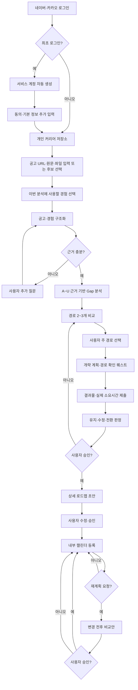

## 1. 서비스 정의

### 1.1 서비스명

**잡이스(Jobis)**

`Jobis`는 기존 국내외 서비스와 이름이 충돌할 가능성이 확인됐다. 이 버전에서는 프로젝트명으로 사용하며, 실서비스 공개 전에 상표·앱스토어·도메인 중복을 다시 검토한다.

### 1.2 제품 설명

**특정 IT 공고를 기준으로 준비·지원 경로를 설계하고 검증하는 취업 준비 AI 에이전트**

### 1.3 한 줄 정의

잡이스는 특정 IT 채용공고와 사용자의 실제 경험 증거를 비교해 현실적인 준비·지원 경로 2~3개를 제시하고, 사용자가 선택한 경로를 작은 결과물로 확인한 뒤 개인 일정에 맞는 로드맵과 내부 캘린더를 생성하는 서비스다.

### 1.4 제품 중심축

제품의 중심은 적합도 점수나 공고 요약이 아니라 다음 의사결정 흐름이다.

```text
특정 IT 채용공고
→ 분석에 사용할 사용자 경험 선택
→ 공고 요구사항과 사용자 증거 Gap 분석
→ 준비·지원 경로 2~3개 비교
→ 사용자 주 경로 선택
→ 개략 계획과 경로 확인 퀘스트
→ 결과물·실제 소요시간 확인
→ 경로 유지·수정·전환 승인
→ 상세 로드맵·내부 캘린더
→ 사용자 직접 수정 또는 요청형 재계획
```

### 1.5 제공하지 않는 핵심 약속

잡이스는 다음을 약속하지 않는다.

- 합격 보장
- 합격확률
- 실제 탈락 원인 판정
- 다른 지원자 대비 경쟁력 판정
- 회사별 합격선
- 특정 자격·기술의 인과적 합격 효과
- 공개 합격 사례를 전체 합격자 통계로 일반화

---

## 2. 해결하려는 사용자 문제

목표 직무와 공고가 있는 학생·신입은 다음을 판단하기 어렵다.

- 공고의 필수조건·우대사항·업무가 실제로 무엇인지
- 자신의 프로젝트와 경험 중 어떤 것을 이번 공고에 사용할지
- 이력서·GitHub·포트폴리오에서 확인되는 증거가 무엇인지
- 경험은 있지만 설명이나 결과물이 부족한 항목이 무엇인지
- 바로 지원할지, 증거를 보강할지, 유사 공고를 병행할지
- 제한된 기간과 개인 일정 안에서 무엇을 먼저 수행할지
- AI가 제안한 계획이 자신의 실제 수준과 수행속도에 맞는지
- 계획이 틀렸을 때 기존 기록을 보존하며 어떻게 다시 조정할지

잡이스는 공고 요구사항과 사용자 증거를 연결한 뒤, 하나의 정답이 아니라 근거가 다른 경로를 비교하게 한다.

---

## 3. 사용자 범위와 이용 시점

### 3.1 2주 MVP 핵심 사용자

- IT 직무를 준비하는 학생·신입
- 목표 직무를 정한 사용자
- 본인 채용공고를 입력하거나 서비스 공고 후보를 선택할 수 있는 사용자
- 일정 기간 동안 직무 증거를 보강하려는 사용자

대학 학년과 준비 기간은 사용자 특성으로 수집할 수 있지만 분석 자격을 제한하는 조건으로 사용하지 않는다.

### 3.2 2주 MVP 완전 지원 직무

- 웹 백엔드 개발자

### 3.3 한 달 MVP

- 공고 기반 IT 직무 범위를 확대
- 사용자 유형은 학생·신입에 집중
- 완전 지원 직무 목록은 직무 기준표·공고 데이터·검증 인력 확보 후 확정

### 3.4 후순위 사용자·모드

- 공고 없는 진로 탐색
- 지원 결과 기반 개선
- 경력 전환·이직
- 멘토·상담사 협업
- 기관·반·담당자 관리

### 3.5 주요 이용 시점

- 목표 공고를 발견했을 때
- 유사한 IT 공고를 기준으로 준비를 시작할 때
- 기존 프로젝트를 지원 자료로 정리할 때
- 어떤 역량부터 보강할지 결정할 때
- 경로 확인 퀘스트를 완료했을 때
- 개인 일정이 바뀌어 재계획이 필요할 때

---

## 4. 전체 사용자 흐름



---

## 5. 인증·계정·권한

### 5.1 2주 MVP 인증

- 네이버 OAuth 로그인
- 카카오 OAuth 로그인
- 최초 로그인 시 서비스 계정 자동 생성
- 자체 이메일·비밀번호 가입은 제외

### 5.2 최초 로그인 흐름

```text
소셜 로그인 승인
→ 공급자 고유 사용자 ID 확인
→ 최초 로그인 여부 판정
→ 잡이스 서비스 계정 생성
→ 약관·개인정보·AI 처리 동의
→ 기본 정보 선택 입력
→ 개인 커리어 저장소 진입
```

### 5.3 계정 규칙

- 이메일이 같다는 이유만으로 네이버·카카오 계정을 자동 병합하지 않는다.
- 소셜 공급자의 성별·연령대·생일을 분석 정보로 자동 저장하지 않는다.
- 추가 정보는 수집 목적과 AI 사용 범위를 표시한 뒤 사용자가 선택한다.
- OAuth Access Token·Refresh Token의 보관 필요성과 암호화 방식은 구현 명세에서 확정한다.
- 회원 탈퇴 시 소셜 연결과 사용자 저장자료의 삭제 절차를 제공해야 한다.

### 5.4 기본 권한

- 사용자 이력·공고·분석·퀘스트·일정은 비공개가 기본이다.
- 한 사용자는 자신의 자료만 조회·수정·삭제할 수 있다.
- 관리자·운영자 권한은 데모 데이터 관리에 필요한 최소 범위로 제한한다.
- 멘토 공유 권한은 후순위다.

---

## 6. 개인 커리어 저장소

### 6.1 목적

사용자가 공고를 분석할 때마다 같은 이력과 프로젝트를 다시 설명하지 않게 하고, 이번 분석에 적합한 경험만 선택할 수 있게 한다.

### 6.2 저장 흐름

```text
파일 업로드 또는 직접 입력
→ 텍스트 추출
→ AI 공통 스키마 구조화
→ 사용자 확인·수정
→ 저장 여부 승인
→ 개인 커리어 저장소 저장
```

새 분석에서 업로드한 자료를 사용자 승인 없이 저장소에 자동 편입하지 않는다.

### 6.3 저장 대상

- 학력·전공·교육과정
- 프로젝트
- 인턴·업무 경험
- 기술과 사용 맥락
- 자격증·어학
- 교육·부트캠프
- 수상·대외활동
- GitHub·포트폴리오·배포 링크
- 문제 상황·조치·성과
- 사용자 역할
- 확인 가능한 결과물

### 6.4 분석별 경험 선택

사용자는 분석마다 이번 공고에 사용할 경험을 선택한다.

예:

- 백엔드 공고: Java·Spring 프로젝트, DB 설계, 배포 경험 선택
- 선택하지 않은 디자인·다른 도메인 경험: 해당 분석에서 제외

AI는 선택된 경험 외 자료를 근거로 사용하지 않는다.

### 6.5 추가 질문

다음이 불분명하면 추가 질문을 생성한다.

- 본인 역할
- 문제 상황
- 해결 방법
- 기술 선택 이유
- 성과 측정 방법
- 개선 전후 수치
- 측정 환경
- 관련 코드·로그·링크

사용자가 실제 값을 제공하지 않으면 수치나 성과를 생성하지 않는다.

---

## 7. 입력 형식과 실패 처리

### 7.1 2주 MVP 지원

#### 사용자 자료

- 직접 텍스트 입력
- TXT
- DOCX
- 텍스트 추출 가능한 PDF
- GitHub 공개 링크
- 포트폴리오·배포 공개 링크

#### 채용공고

- URL
- 원문 붙여넣기
- TXT·DOCX·텍스트형 PDF
- 서비스가 제공한 선별 공고 선택

### 7.2 제한·제외

- HWP 자동 파싱 성공 보장 제외
- 이미지형 PDF OCR 성공 보장 제외
- 이미지 공고 자동 인식 제외
- 비공개 저장소 자동 접근 제외

### 7.3 fallback

```text
파일 파싱 시도
→ 성공: 추출 결과 사용자 확인
→ 실패: 원문 붙여넣기 안내
→ 사용자 확인·수정
→ 분석 진행
```

파서 실패가 전체 분석을 중단시키지 않게 한다.

---

## 8. A~U 데이터 근거 정책

### 8.1 근거 등급

| 등급 | 데이터 | 사용 범위 |
|---|---|---|
| A | 목표 공고 원문 | 명시 필수·우대·담당 업무·지원 조건 |
| B | 공식 직무자료·동종 공고 반복 신호 | 직무 공통 기준과 보완 우선순위 |
| C | 기업 공식자료 | 서비스·기술·도메인 맥락과 프로젝트 후보 |
| D | 사용자 제공 합격·현직 사례 | 건별 참고와 추가 질문 후보 |
| U | 사용자 실제 경험·결과물 | 현재 보유 직무 증거 |

### 8.2 기본 결합 규칙

```text
A 요구 + U 확인 증거
→ 해당 공고 요구사항 증거 확인

A 요구 + U 증거 없음
→ 해당 공고 기준 미확인 또는 필수조건 부족

B 반복 신호 + U 증거 없음
→ 직무 공통 보완 후보

C 기업 맥락
→ 프로젝트 주제·업무 맥락 제안

D 사례
→ 참고 카드·추가 질문
```

### 8.3 금지 규칙

- B·C·D를 목표 공고의 명시 필수조건으로 승격하지 않는다.
- C의 기업 인재상을 성격 적합도나 점수에 사용하지 않는다.
- D를 점수·합격 기준·합격확률에 사용하지 않는다.
- 벡터 검색 유사도를 근거 신뢰도나 적합도로 표현하지 않는다.
- 근거가 없으면 `미확인`, `사용자 확인 필요`, `판단 불가`로 종료한다.

### 8.4 근거 레코드

```json
{
  "claim": "통합 테스트 경험이 현재 자료에서 확인되지 않음",
  "claimType": "evidence_gap",
  "sourceGrade": "A",
  "sourceType": "job_posting",
  "sourceUrl": "string",
  "sourceExcerpt": "테스트 코드 작성 경험이 있으신 분",
  "collectedAt": "datetime",
  "userEvidenceIds": [],
  "status": "unconfirmed",
  "limitations": [
    "우대사항이며 필수조건이 아님"
  ]
}
```

주요 판단은 출처 URL, 원문 인용, 수집일, 한계를 가져야 한다.

---

## 9. 데이터 수집 전략

### 9.1 2주 MVP 데이터 구성

```text
사용자 입력 공고
+ 팀이 선별·검토한 백엔드 데모 공고
+ NCS·워크넷 직무자료
+ 기업 공식자료
+ 사용자 실제 경험
```

### 9.2 공고 데이터

우선순위:

1. 사용자가 제공한 공고 원문
2. 팀이 검토한 데모 공고
3. 승인·허용된 공식 채용공고 API
4. 기업 공식 채용 페이지

공식 API 승인이 늦거나 호출에 실패해도 원문 입력과 데모 공고로 전체 흐름을 실행할 수 있어야 한다.

### 9.3 공식 직무자료

- NCS 기준정보
- NCS 능력단위
- 워크넷·고용24 직무데이터사전
- 워크넷 표준직무기술서
- 팀이 검토한 백엔드 직무 기준표

NCS만으로 최신 백엔드 기술을 정의하지 않는다. 공식 직무자료와 동종 공고 반복 신호를 분리해 사용한다.

### 9.4 기업 공식자료

수집 대상:

- 기업 공식 홈페이지
- 공식 서비스 소개
- 공식 기술 블로그
- 공식 채용 페이지
- 공식 직무 인터뷰

목표 공고와 관련된 기업만 요청 시 조회한다. 전체 기업 자료를 사전 대량 수집하지 않는다.

### 9.5 합격 후기·현직 사례

- 자동 대량 수집하지 않는다.
- 사전 합격 후기 DB를 2주 MVP에 만들지 않는다.
- 사용자가 제공한 URL·문서를 해당 분석의 건별 참고로만 사용한다.
- 원문 전체 복제와 개인 식별정보 저장을 피한다.
- 출처·수집일·대표성 한계를 표시한다.
- 전체 합격자 통계나 비교 지원자 데이터로 일반화하지 않는다.

### 9.6 제외

- 범용 사이트 크롤러
- 로그인·차단 우회
- 합격 후기 자동 수집 파이프라인
- 현직자 프로필 대량 수집
- 타인 포트폴리오 대량 비교
- Airflow·cron 기반 전체 자동 수집

---

## 10. 분석 결과

### 10.1 공고 구조화

- 담당 업무
- 명시 필수조건
- 우대사항
- 기술 스택
- 요구 경력
- 학력·전공·자격 조건
- 업무·프로젝트·협업·운영 경험 요구
- 원문 인용
- 출처 URL·수집일

### 10.2 사용자 증거 구조화

- 프로젝트와 역할
- 기술 사용 맥락
- 업무·학습 경험
- 테스트·배포·운영·협업 경험
- 성과와 측정 근거
- GitHub·포트폴리오·배포 링크
- 사용자 진술만 있는 항목
- 추가 확인이 필요한 항목

### 10.3 상태값

| 상태 | 의미 |
|---|---|
| 확인 | 제출 자료·링크·사용자 확인으로 근거가 연결됨 |
| 부분 확인 | 관련 경험은 있으나 역할·범위·결과가 불충분 |
| 미확인 | 선택한 자료에서 찾지 못함 |
| 명시적 필수조건 부족 | 공고 원문 필수조건과 충돌 |
| 사용자 확인 필요 | AI 추출·연결 결과를 사용자가 확인해야 함 |

### 10.4 결과 영역

1. 공고 요구사항
2. 현재 확인된 강점과 증거
3. 부분 확인·미확인·필수조건 부족
4. 준비 우선순위와 근거
5. 후보 경로 2~3개
6. 판단 불가와 데이터 한계
7. 출처 목록

### 10.5 점수 정책

- 종합 적합도·준비도 점수를 표시하지 않는다.
- 축별 숫자 점수도 2주 MVP에서 제외한다.
- 요구사항 상태와 준비 우선순위를 사용한다.
- 준비 우선순위는 공고 명시 수준, 직무 반복 신호, 사용자 증거, 남은 기간을 근거로 설명한다.
- 다른 지원자 대비 경쟁력은 판단하지 않는다.

### 10.6 표현 정책

피해야 할 표현:

- 지원 불가
- 합격 가능
- 반드시 필요
- 이 직무와 맞지 않음
- 다른 지원자보다 경쟁력 있음

사용할 표현:

- 목표 공고의 명시 필수조건과 충돌합니다.
- 선택한 사용자 자료에서는 해당 경험을 확인하지 못했습니다.
- 우대사항으로 명시돼 있으며 필수조건은 아닙니다.
- 동종 공고 표본에서 반복되지만 전체 시장을 대표하지 않습니다.
- 현재 근거만으로는 판단할 수 없습니다.

---

## 11. 후보 경로와 경로 확인

### 11.1 경로 생성

Gap 분석 뒤 현실적인 준비·지원 경로 2~3개를 생성한다.

예:

- 현재 증거를 정리해 목표 공고에 지원
- 기존 프로젝트의 테스트·배포 증거를 보강한 뒤 지원
- 요구조건이 낮은 유사 공고를 병행하면서 핵심 증거 보강

모든 사용자에게 같은 세 유형을 강제하지 않는다.

### 11.2 경로 비교 항목

- 경로 설명
- A~U 추천 근거
- 현재 확인된 증거
- 보강할 증거
- 명시적 필수조건 위험
- 예상 준비 부담
- 대표 결과물
- 장점
- 위험
- 판단 불가
- 관련 공고

### 11.3 주 경로

- 사용자가 하나를 선택한다.
- AI가 자동 확정하지 않는다.
- 다른 경로는 후보로 보존한다.
- 경로 확인 뒤 유지·수정·전환할 수 있다.

### 11.4 경로 확인 퀘스트

상세 로드맵 전에 선택 경로와 현재 수준을 확인하는 결과물 중심 실행 단위다.

예:

> 기존 Spring 프로젝트의 핵심 API에 통합 테스트를 추가하고, 실패·수정 과정과 실제 소요시간을 README에 기록한다.

필드:

- 확인할 가정
- 수행 내용
- 예상 시간
- 완료 산출물
- 완료 기준
- 관련 공고 요구사항
- 증거 제출 방식
- 실제 소요시간
- 사용자 회고

### 11.5 판정

- 경로 유지
- 경로 수정
- 다른 경로로 전환
- 추가 근거 필요

경로 확인 결과는 직무 적합성이나 합격 가능성을 확정하지 않는다.

---

## 12. 상세 로드맵·퀘스트·캘린더

### 12.1 상세 로드맵 생성 조건

1. 사용자가 주 경로를 선택함
2. 경로 확인 퀘스트 결과를 제출함
3. 유지·수정·전환 판정을 확인함
4. 사용자가 최종 경로를 승인함
5. 목표 기간과 개인 일정을 입력함

조건을 충족하기 전에는 경로별 개략 계획만 보여준다.

### 12.2 퀘스트 정의

퀘스트는 직무 요구와 연결된 목적·산출물·완료 기준을 가진 실행 단위다.

- 퀘스트명
- 목적
- 관련 공고 요구사항
- A~U 근거
- 세부 작업
- 산출물
- 완료 기준
- 예상 소요시간
- 시작일·종료일
- 우선순위
- 상태

### 12.3 활성 퀘스트

- 상세 계획에서는 3~5개를 활성화한다.
- 초과 퀘스트는 백로그에 둔다.
- 3~5개는 검증 가설이며 완료율·보류율·일정 초과로 조정한다.

### 12.4 내부 캘린더

- 일정 제목
- 시작일
- 종료일
- 목표
- 세부 작업
- 완료 기준
- 우선순위
- 관련 공고 요구사항
- 예정·진행 중·완료·보류 상태
- 사용자의 직접 이동·수정

외부 캘린더 연동은 후순위다.

### 12.5 계획 JSON 예시

```json
{
  "title": "Spring 프로젝트 테스트 증거 보강",
  "startDate": "2026-08-01",
  "endDate": "2026-08-14",
  "goal": "통합 테스트와 실행 결과를 GitHub에 남김",
  "tasks": [
    "테스트 대상 선정",
    "통합 테스트 작성",
    "CI 실행 결과 확인",
    "README 근거 연결"
  ],
  "acceptanceCriteria": [
    "테스트 코드 링크 존재",
    "실행 결과 존재",
    "사용자 역할 설명 존재"
  ],
  "priority": 1,
  "requirementIds": ["req-test-001"]
}
```

날짜와 작업은 실제 사용자 입력과 승인된 경로를 바탕으로 생성하며 예시 값을 그대로 사용하지 않는다.

### 12.6 재계획

2주 MVP:

- 사용자가 일정을 직접 수정
- 사용자가 `재계획 요청`을 실행
- AI가 변경 전후 비교안 생성
- 사용자 승인 후 적용
- 자동 이벤트 감지 제외
- 자동 적용 제외

후순위:

- 자연어 기반 전체 일정 수정
- 상태 이벤트 자동 감지
- 자동 재배치
- 외부 캘린더 연동

---

## 13. Agent·RAG 구조

### 13.1 핵심 구조

```text
단일 오케스트레이터
+ 명시적 툴
+ 관계형 DB
+ A~U 근거 검증 규칙
+ 제한형 공식자료 RAG 툴
```

### 13.2 오케스트레이터 책임

- 공고 원문과 선택 경험 확인
- 자료 충분성 판단
- 필요한 툴 선택
- 사용자 추가 질문
- 공식자료 조회 필요 여부 판단
- 도구 결과 검증
- 제한된 재시도
- 반복 실패 시 사용자 알림
- 최종 JSON 구조화

### 13.3 2주 MVP 툴

- 공고 입력·파싱 툴
- 사용자 경험 조회 툴
- 요구사항 원문 검증 툴
- 공식 직무정보 조회 툴
- 사용자 증거 연결 툴
- 근거 충분성 검사 툴
- 경로 생성 툴
- 경로 확인 퀘스트 생성 툴
- 로드맵 생성 툴
- 요청형 재계획 툴

### 13.4 관계형 DB 사용 영역

- 계정
- 개인 커리어 저장소
- 채용공고
- 요구사항
- 근거 레코드
- 경로
- 퀘스트
- 계획
- 일정
- 사용자 승인·수정 이력

정확한 ID와 상태 조회가 가능한 자료를 벡터 검색으로 대체하지 않는다.

### 13.5 제한형 RAG

목적:

- 공식 직무 설명의 관련 문단 검색
- 기업 공식 기술·서비스·직무자료 검색

대상:

- 이용 가능한 공식 직무자료
- 기업 공식 기술자료
- 기업 공식 직무 인터뷰
- 팀이 출처를 검토한 설명 문서

제외:

- 사용자 이력서·커리어 저장소
- 합격 후기
- 현직자 프로필
- 출처 불명 웹 자료
- 필수·우대 판정 원문

RAG는 비필수 보조 툴이다. 검색 실패 시 기업·직무 맥락을 생략하고 핵심 공고 분석을 계속한다.

### 13.6 RAG 결과 규칙

```json
{
  "sourceGrade": "C",
  "sourceType": "company_official",
  "sourceUrl": "string",
  "sourceExcerpt": "string",
  "collectedAt": "datetime",
  "retrievalScore": 0.0,
  "allowedUsage": "context_only"
}
```

- 검색 유사도는 검색 순위 값이다.
- 검색 유사도를 근거 신뢰도·준비도·적합도로 사용하지 않는다.
- 출처 문장이 없는 검색 결과는 최종 근거에서 제외한다.

### 13.7 후순위 기술

- 멀티에이전트
- MCP
- 범용 웹 RAG
- 사용자 자료 벡터화
- 합격 후기 벡터화
- 대규모 별도 벡터 인프라
- 전체 자동 수집 스케줄러

---

## 14. AI와 규칙 기반 검증

### 14.1 생성형 AI

- 이력서·프로젝트·공고의 비정형 내용 해석
- 공고 요구사항 후보 추출
- 사용자 경험과 요구사항 연결 후보
- 부족 정보 추가 질문
- 경로·퀘스트·계획 초안
- 재계획 설명 초안

### 14.2 규칙 계층

- 공고 원문 인용 존재 확인
- 필수·우대·업무 구분
- A~U 등급별 허용 사용
- 사용자에게 없는 경험 생성 차단
- 일정 충돌·가용 시간 검사
- 경로 확인 완료 조건
- 상세 계획 생성 조건
- 활성 퀘스트 3~5개 제한
- 사용자 승인 상태
- 합격확률·경쟁력·탈락 원인 단정 차단

### 14.3 사용자 통제

- AI가 추출한 요구사항 수정
- AI가 구조화한 사용자 경험 수정
- 분석에 사용할 경험 선택
- 주 경로 선택
- 경로 확인 결과 승인
- 상세 계획 수정·승인
- 재계획 변경안 승인·거절

---

## 15. 백엔드·AI 입력·출력 계약

### 15.1 개발 원칙

- 백엔드와 AI 서버의 입출력 계약을 먼저 정의한다.
- 모든 내부 구현을 끝낸 뒤 한 번에 연결하지 않는다.
- 데모 공고와 고정 사용자 데이터를 이용한 contract test를 유지한다.
- 근거 ID·사용자 수정·승인 상태를 요청과 응답에 포함한다.

### 15.2 분석 요청 예시

```json
{
  "userId": "user-001",
  "jobPostingId": "job-010",
  "selectedExperienceIds": ["exp-003", "exp-007"],
  "targetEndDate": "2026-12-31",
  "availableHoursPerWeek": 20,
  "useOfficialContextRag": true
}
```

### 15.3 분석 응답 예시

```json
{
  "requirements": [],
  "evidenceMatrix": [],
  "strengths": [],
  "gaps": [],
  "priorities": [],
  "routes": [],
  "followUpQuestions": [],
  "sources": [],
  "limitations": [],
  "ragStatus": "success | skipped | failed"
}
```

### 15.4 계획 응답 예시

```json
{
  "routeId": "route-001",
  "verificationResultId": "verification-result-001",
  "goalPeriod": {},
  "activeQuests": [],
  "backlogQuests": [],
  "calendarItems": [],
  "approvalStatus": "draft"
}
```

---

## 16. UI 원칙과 주요 화면

### 16.1 상호작용

- 자료 입력과 추가 질문은 대화형으로 제공할 수 있다.
- 요구사항·증거·경로·퀘스트·일정은 구조화 화면으로 제공한다.
- 긴 결과를 채팅 메시지에만 넣지 않는다.
- AI 판단마다 근거·한계·수정 기능을 연결한다.

### 16.2 에이전트 진행 상태

표시:

- 채용공고 분석 중
- 선택 경험 조회 중
- 공식 직무자료 조회 중
- 근거 충분성 확인 중
- 추가 사용자 정보 필요
- 경로 생성 중
- 출처 검증 완료·일부 실패
- 제한형 RAG 조회 성공·실패·생략

표시하지 않음:

- 원시 Chain-of-Thought
- 내부 프롬프트
- OAuth 비밀정보
- 실제 구조와 다른 가상 멀티에이전트 협업
- 직원 캐릭터·모션

### 16.3 주요 화면

1. 네이버·카카오 로그인
2. 최초 로그인 동의·기본 정보
3. 개인 커리어 저장소
4. 자료 업로드·구조화 결과 확인
5. 목표 공고 입력·선택
6. 분석 경험 선택
7. 에이전트 실행 상태
8. 요구사항·증거 Gap 결과
9. 준비 우선순위
10. 경로 2~3개 비교
11. 경로 선택
12. 개략 계획·경로 확인 퀘스트
13. 결과물·회고 제출
14. 경로 유지·수정·전환 승인
15. 상세 로드맵 검토
16. 내부 캘린더
17. 직접 일정 수정
18. 재계획 요청·변경 전후 비교·승인

---

## 17. 주요 데이터 객체

### 17.1 사용자 계정

```json
{
  "userId": "string",
  "oauthProvider": "naver | kakao",
  "oauthSubject": "string",
  "serviceProfileCompleted": false,
  "consents": {},
  "createdAt": "datetime"
}
```

### 17.2 커리어 경험

```json
{
  "experienceId": "string",
  "userId": "string",
  "type": "education | project | work | certificate | activity",
  "title": "string",
  "userRole": "string",
  "technologies": [],
  "claims": [],
  "evidenceUrls": [],
  "sourceDocumentId": "string",
  "userConfirmed": false
}
```

### 17.3 공고 요구사항

```json
{
  "requirementId": "string",
  "jobPostingId": "string",
  "type": "required | preferred | responsibility | condition",
  "text": "string",
  "sourceExcerpt": "string",
  "sourceUrl": "string",
  "userCorrected": false
}
```

### 17.4 근거 연결

```json
{
  "evidenceLinkId": "string",
  "requirementId": "string",
  "experienceId": "string",
  "sourceGrade": "A | B | C | D | U",
  "status": "confirmed | partial | unconfirmed | hard_requirement_gap | user_confirmation_required",
  "fact": "string",
  "interpretation": "string",
  "limitations": [],
  "userConfirmed": false
}
```

### 17.5 후보 경로

```json
{
  "routeId": "string",
  "title": "string",
  "rationaleEvidenceIds": [],
  "confirmedEvidenceIds": [],
  "missingEvidenceIds": [],
  "hardRequirementRisks": [],
  "representativeDeliverables": [],
  "benefits": [],
  "risks": [],
  "unknowns": [],
  "status": "candidate | selected | verifying | active | archived"
}
```

### 17.6 경로 확인 퀘스트

```json
{
  "verificationQuestId": "string",
  "routeId": "string",
  "assumptionToCheck": "string",
  "instructions": [],
  "deliverables": [],
  "acceptanceCriteria": [],
  "estimatedHours": null,
  "actualHours": null,
  "reflection": {},
  "result": "pending | keep | revise | switch | more_evidence"
}
```

### 17.7 상세 계획

```json
{
  "planId": "string",
  "routeId": "string",
  "activeQuestIds": [],
  "backlogQuestIds": [],
  "calendarItemIds": [],
  "approvalStatus": "draft | pending | approved | rejected",
  "approvedAt": null
}
```

### 17.8 재계획안

```json
{
  "replanId": "string",
  "requestedByUser": true,
  "beforePlanId": "string",
  "proposedChanges": [],
  "reasonEvidenceIds": [],
  "status": "pending | approved | rejected"
}
```

---

## 18. 2주 MVP 포함·제외

### 18.1 반드시 포함

1. 네이버 OAuth 로그인
2. 카카오 OAuth 로그인
3. 최초 로그인 자동 계정 생성과 동의
4. 개인 커리어 저장소
5. 직접 입력·TXT·DOCX·텍스트형 PDF
6. AI 구조화와 사용자 확인·수정·저장 승인
7. 분석별 경험 선택
8. 공고 URL·원문·파일 입력과 선별 공고 선택
9. 공고 요구사항 원문 추출
10. A~U 근거 레코드
11. 요구사항별 증거 상태와 준비 우선순위
12. 경로 2~3개 비교와 사용자 선택
13. 경로 확인 퀘스트 1개
14. 결과물·실제 소요시간 제출
15. 경로 유지·수정·전환 판정과 승인
16. 상세 로드맵·활성 퀘스트 3~5개
17. 내부 캘린더와 직접 수정
18. 사용자 요청형 재계획과 변경 전후 비교
19. 단일 오케스트레이터와 명시적 툴
20. 관계형 DB
21. 공식 직무·기업자료 전용 비필수 RAG
22. 에이전트 실행 상태·출처 상태 표시
23. 백엔드·AI JSON 계약

### 18.2 제외·후순위

- 자체 이메일·비밀번호 로그인
- 소셜 계정 자동 병합
- HWP 파싱 성공 보장
- 이미지·OCR 필수 지원
- 합격 후기 사전 DB
- 범용 크롤러
- 합격자·현직자·포트폴리오 대량 수집
- 종합 준비도·적합도 점수
- 다른 지원자 대비 경쟁력
- 멀티에이전트
- 직원 캐릭터 UI
- MCP
- 사용자 이력·후기 벡터화
- 전체 이벤트 자동 감지
- 자동 계획 적용
- 외부 캘린더 연동
- 멘토·상담사 협업
- 경력자·진로 탐색 지원

---

## 19. 대표 2주 MVP 시나리오

1. 사용자가 네이버 또는 카카오로 로그인한다.
2. 최초 로그인 시 서비스 계정이 생성되고 동의·기본 정보를 입력한다.
3. 이력서 파일을 올리거나 경험을 직접 입력한다.
4. AI가 프로젝트·기술·역할·성과를 구조화한다.
5. 사용자가 결과를 수정하고 저장을 승인한다.
6. 백엔드 공고를 직접 입력하거나 서비스 후보에서 선택한다.
7. 이번 분석에 사용할 경험을 선택한다.
8. Agent가 공고 요구사항을 원문 인용과 함께 추출한다.
9. 필요한 경우 공식 직무자료와 기업자료를 조회한다.
10. 자료가 부족하면 사용자에게 추가 질문한다.
11. 요구사항별 확인·부분 확인·미확인·필수조건 부족을 표시한다.
12. 점수 대신 준비 우선순위와 근거를 보여준다.
13. 서로 다른 준비·지원 경로 2~3개를 비교한다.
14. 사용자가 주 경로를 선택한다.
15. 개략 계획과 경로 확인 퀘스트 하나를 받는다.
16. 결과물·실제 소요시간·회고를 제출한다.
17. Agent가 경로 유지·수정·전환안을 제시한다.
18. 사용자가 경로를 승인한다.
19. 상세 로드맵과 활성 퀘스트 3~5개를 생성한다.
20. 사용자가 계획을 수정·승인하고 내부 캘린더에 등록한다.
21. 필요할 때 재계획을 요청한다.
22. 변경 전후 비교안을 확인하고 승인 또는 거절한다.

---

## 20. 효과 측정

### 20.1 근거 정확성

- 요구사항마다 공고 원문이 연결되는가
- AI가 필수·우대를 잘못 분류하지 않는가
- 사용자에게 없는 경험을 생성하지 않는가
- A~U 등급별 사용 규칙을 지키는가
- 사용자가 오분류를 수정할 수 있는가

### 20.2 사용자 이해

- 사용자가 확인·부분 확인·미확인의 차이를 이해하는가
- 경로 2~3개의 차이와 위험을 설명할 수 있는가
- 경로 추천의 출처와 한계를 확인하는가

### 20.3 행동 전환

- 사용자가 주 경로를 선택하는가
- 경로 확인 퀘스트를 시작·완료하는가
- 검증 가능한 결과물을 남기는가
- 실제 소요시간이 상세 계획에 반영되는가
- 상세 계획을 수정·승인하는가

### 20.4 운영 안정성

- OAuth 실패 시 사용자에게 원인을 안내하는가
- 파일 파싱 실패 시 붙여넣기 fallback으로 전환하는가
- 공식 API·RAG 실패 시 핵심 분석을 계속하는가
- 사용자 승인 없이 저장·계획·재계획을 확정하지 않는가

### 20.5 장기 지표

- 결과물의 이력서·GitHub·포트폴리오 반영
- 실제 지원 여부
- 전형 단계 변화
- 사용자가 동의한 지원 결과

취업률이나 합격률을 초기 MVP의 직접 효과로 주장하지 않는다.

---

## 21. 구현 위험과 대응

### 21.1 2주 범위 과다

위험:

- 소셜 로그인 2종, 파일 파싱, 저장소, Agent, 경로, 퀘스트, 캘린더의 통합 지연

대응:

- 백엔드 직무와 고정 데모 공고로 수직 흐름 우선
- 범용 크롤러·합격 후기 DB·멀티에이전트 제외
- 제한형 RAG를 비필수로 유지
- 입력·출력 contract test 우선

### 21.2 API 승인 지연

대응:

- 사용자 원문 입력
- 팀 검토 데모 공고
- 공식 API adapter를 교체 가능하게 분리

### 21.3 경로 확인 단계 이탈

대응:

- 선택 직후 경로별 개략 계획과 확인 목적을 설명
- 퀘스트의 산출물·완료 기준·예상시간을 구체화
- 데모에서는 준비된 완료 결과로 전체 흐름 시연

### 21.4 근거 등급 혼용

대응:

- 데이터 객체에 `sourceGrade`와 `allowedUsage` 저장
- 규칙 계층에서 B·C·D의 강한 판정 사용 차단
- 결과 화면에 근거 배지와 한계 표시

### 21.5 서비스명 충돌

대응:

- Jobis 이름은 기존 서비스와 충돌할 수 있으므로 현재는 프로젝트명으로만 사용
- 실서비스 공개 전 상표·도메인·앱스토어 중복 검토

---

## 22. 잠정 역할 분담과 개발 계약

회의안의 역할 분담은 잠정안으로 보존한다.

| 영역 | 잠정 담당 |
|---|---|
| 에이전트 흐름·툴 설계 | 김주형, 정율 |
| 데이터 수집·정제 | 윤성용 |
| 제한형 RAG·검색 | 박한수 |
| 데이터·RAG 지원·통합 | 김동혁 |
| 프론트엔드·백엔드 | 하서진 중심 |
| AI·백엔드 입출력 계약 | 관련 담당자 공동 |

담당은 진행 상황에 따라 바꿀 수 있다. 기능 책임과 JSON 계약은 공동 문서로 관리한다.

---

## 23. 구현 전에 확정할 항목

- 네이버·카카오 개발자 앱 등록과 callback URL
- OAuth 토큰 저장·갱신·폐기 방식
- 계정 탈퇴와 개인정보 삭제 범위
- DOCX·PDF 파서 라이브러리
- 원본 파일 저장 위치·보관 기간·악성 파일 검사
- 백엔드 데모 공고 목록과 수집일
- NCS·워크넷 API 신청·이용조건
- 사람인·잡코리아 API 신청 여부
- 백엔드 직무 기준표
- 기업 공식자료 allowlist
- 제한형 RAG의 저장소와 임베딩 모델
- 청킹·메타데이터·검색 실패 기준
- Agent 재시도 횟수와 중단 조건
- 활성 퀘스트 일정 배치 규칙
- 백엔드·AI API schema와 오류 코드
- `Jobis` 브랜드 중복·상표·도메인 재검토 시점

확인되지 않은 수치·도구·API 품질을 정본에 사실처럼 추가하지 않는다.

---

## 24. 검토 근거와 데이터 이용 한계

### 24.1 공식 채용·직무 데이터

- [사람인 채용정보 API](https://oapi.saramin.co.kr/introduce)
- [사람인 API 주의사항](https://oapi.saramin.co.kr/caution)
- [잡코리아 API 안내](https://www.jobkorea.co.kr/service/api)
- [NCS 기준정보 API](https://www.data.go.kr/data/15128213/openapi.do)
- [워크넷·고용24 채용정보 API](https://www.data.go.kr/data/3038225/openapi.do)
- [워크넷 직무데이터사전](https://www.data.go.kr/data/15088880/openapi.do)
- [워크넷 표준직무기술서](https://www.data.go.kr/data/15088876/openapi.do)

확인한 이용 한계:

- 사람인 API는 승인과 Access Key가 필요하고 출처 표시 의무와 이용 제한이 있다.
- 잡코리아 API는 공공기관·학교에 우선 제공되며 일반 서비스는 내부 검토 결과에 따라 이용하지 못할 수 있다.
- 워크넷 채용정보 API는 공공데이터포털에 출처 표시·비영리·변경 금지 조건이 표시되므로 데모와 향후 서비스에서 이용 범위를 별도로 확인한다.
- NCS 기준정보는 직무 분류와 능력단위에 사용하며 최신 IT 기술 요구를 단독으로 대표한다고 보지 않는다.
- 공식 API 승인 지연과 이용 제한 때문에 사용자 원문 입력과 팀 검토 데모 공고를 필수 fallback으로 둔다.

### 24.2 계획·행동 개입 근거

- [J-PAL 구직 계획 실험](https://www.povertyactionlab.org/evaluation/impact-job-search-planning-intervention-job-search-efficiency-and-employment-among-youth)
- [구직 개입 메타분석](https://research.monash.edu/en/publications/effectiveness-of-job-search-interventions-a-meta-analytic-review)
- [미국 노동부 행동 개입 실험](https://www.dol.gov/sites/dolgov/files/OASP/evaluation/pdf/Behavioral-Insights-IJS.pdf)
- [AI 진로지원 역할 연구](https://files.eric.ed.gov/fulltext/EJ1318705.pdf)
- [한국고용정보원 잡케어 적용 연구](https://www.keis.or.kr/keis/ko/proj/113/pblc/detail.do?categoryIdx=131&pubIdx=11297)

해석 한계:

- 구직 계획과 사람의 피드백을 포함한 개입이 행동·결과 개선과 관련된 연구가 있지만, 잡이스 또는 AI 생성 로드맵의 직접 효과를 입증하지 않는다.
- 정보 제공만 늘리면 사용자의 행동이 개선된다고 가정하지 않는다.
- 초기 효과는 취업률이 아니라 근거 정확성, 경로 선택, 확인 퀘스트 실행, 결과물 생성, 계획 승인으로 검증한다.

---

## 25. 승인 기준

이 버전과 구현이 일치하려면 다음을 확인한다.

- 특정 IT 공고가 기본 진입점인가
- 초기 사용자가 목표 직무가 있는 학생·신입인가
- 2주 완전 지원 직무가 백엔드인가
- 개인 커리어 저장이 사용자 승인 뒤 이뤄지는가
- 사용자가 분석할 경험을 선택하는가
- 네이버·카카오 최초 로그인으로 서비스 계정이 생성되는가
- 파싱 실패 시 원문 붙여넣기가 가능한가
- A~U 근거 등급과 허용 사용이 분리되는가
- 모든 주요 판단에 출처·원문·수집일·한계가 연결되는가
- 종합 점수와 다른 지원자 대비 경쟁력을 표시하지 않는가
- 경로 2~3개를 사용자가 비교·선택하는가
- 경로 확인 퀘스트 완료·승인 전 상세 로드맵을 생성하지 않는가
- 상세 계획에 활성 퀘스트 3~5개를 두는가
- 재계획이 사용자 요청과 승인으로만 적용되는가
- 단일 오케스트레이터와 관계형 DB가 핵심인가
- 제한형 RAG가 실패해도 핵심 분석이 가능한가
- 멀티에이전트 직원형 UI를 2주 범위에 넣지 않는가
- 한 달에도 학생·신입을 유지하고 공고 기반 IT 직무만 확장하는가
- 잡이스 이름 충돌 위험을 출시 전 다시 검토하는가
