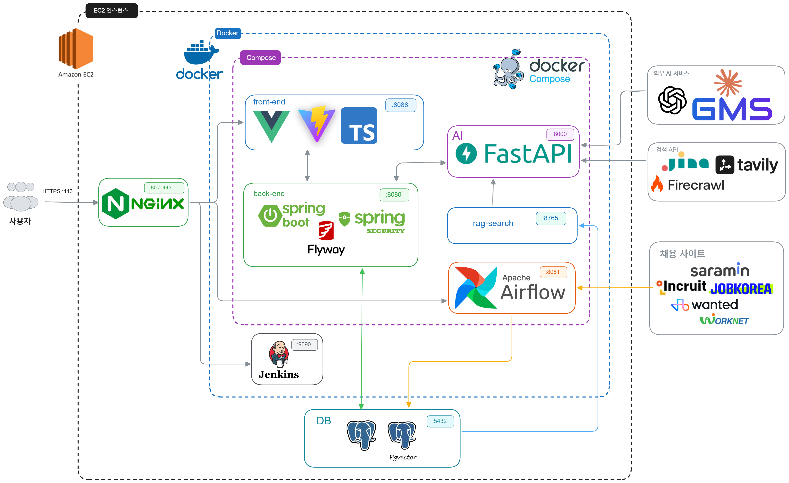
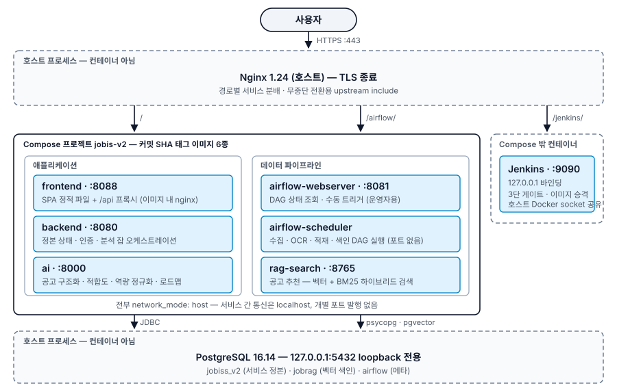
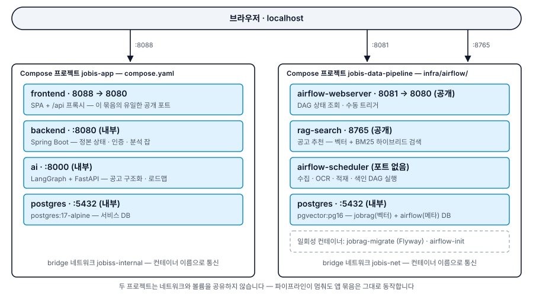
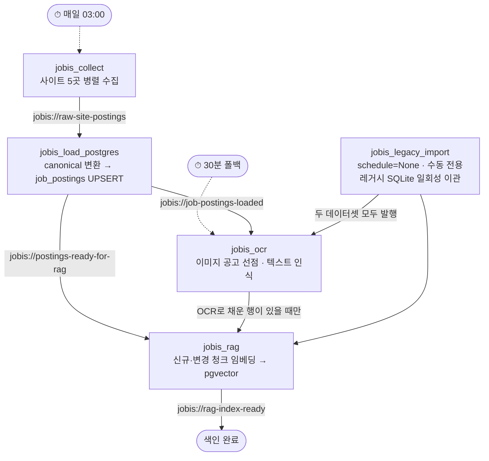

# JOBIS : 채용 공고에서 시작하는 커리어 성장 AI 에이전트

> 공고를 등록하면 AI가 요구 역량을 구조화하고, 사용자의 실제 경험과 대조해 **준비할 항목만**
> 짚어 로드맵과 학습 플랜으로 잇습니다. 판단은 데이터가 하고, LLM은 읽기와 표현만 맡습니다.

---

## 📋 목차

- [🎯 프로젝트 소개](#-프로젝트-소개)
- [✨ 주요 화면](#-주요-화면)
- [🛠 기술 스택](#-기술-스택)
- [🏗 시스템 아키텍처](#-시스템-아키텍처)
- [📁 프로젝트 구조](#-프로젝트-구조)
- [⚡ 실행 방법](#-실행-방법)
- [🚢 배포](#-배포)
- [📚 참고 자료](#-참고-자료)

---

## 🎯 프로젝트 소개

### 왜 JOBIS?

> 취업 준비의 병목은 정보가 없는 것이 아니라 **판단이 서지 않는 것**입니다.

공고는 읽었지만 "지금 지원해도 되는가", "안 된다면 정확히 무엇이 부족한가"에 답이 없습니다.
JOBIS는 그 판단을 데이터로 만듭니다. 공고의 요구 역량을 원자 단위로 정규화하고 사용자의
커리어 근거와 대조해 **채워진 것과 비어 있는 것을 구분**한 뒤, 비어 있는 항목만 로드맵과
학습 플랜으로 연결합니다.

### 핵심 특장점

**1. 점수 대신 근거를 제시합니다**
합격 확률이나 적합도 점수를 만들지 않습니다. 공고의 필수조건·우대사항·담당 업무를 사용자의
실제 경험과 연결하고, 판단 근거를 출처·원문·수집일과 함께 저장해 추적할 수 있게 합니다.

**2. 판정하지 못한 항목을 부족으로 세지 않습니다**
근거가 없으면 `not_met`이 아니라 `uncertain`으로 분모에서 제외하고 되묻습니다. 모르는 것을
부족으로 세면 근거 없는 로드맵이 쌓입니다.

**3. 생성 결과를 규칙으로 다시 검증합니다**
AI는 허용된 도구만 호출하며, 결과는 필수·우대 구분과 근거 존재 여부 규칙으로 재검사합니다.
매칭·계산·분기는 결정론 코드가 담당하고 LLM은 읽기와 표현만 맡습니다.

**4. 자동 확정과 자동 적용을 차단합니다**
경험 저장, 계획 적용, 재계획에 모두 사용자 승인을 요구합니다. 상태 전이는 관계형 데이터와
실행 이력으로 남아 되돌릴 수 있습니다. 외부 자료 조회(RAG)는 보조 기능으로 분리해 검색이
실패해도 핵심 분석이 계속되며, 폴백 사유는 경고로 노출합니다.

### 타겟 유저

- **취업 준비생** : 지원할 공고는 정했지만 무엇을 더 준비해야 하는지 판단이 서지 않는 경우
- **직무 기반으로 성장을 설계하려는 학생** : 막연한 학습 대신 실제 공고의 요구 역량을
  기준으로 준비 순서를 잡고 싶은 경우
- **커리어 전환을 준비하는 비개발 직무 재직자** : 기존 경험 중 무엇이 근거로 인정되고
  무엇을 새로 채워야 하는지 구분이 필요한 경우

---

## ✨ 주요 화면

### 1. 랜딩 : 첫 진입과 로그인


### 2. 커리어 저장소 : 이력서·포트폴리오를 근거 단위로 분해


- docx, txt, md 파일의 첨부를 지원합니다.
- 업로드한 이력서·포트폴리오를 커리어 조각으로 분해해 저장합니다.
- 중복 조각은 병합하되 되돌릴 수 있게 남깁니다.
- 종류·등록일·최근 수정 기준으로 정렬하고 원본 자료를 다시 확인할 수 있습니다.

### 3. 대화 : 커리어 저장소 기반 역량 분석


- 저장된 커리어 조각을 근거로 현재 역량을 정리합니다
- 근거가 부족한 항목은 실패로 처리하지 않고 `답변 필요` 상태로 되묻습니다
- 사용자 메시지는 즉시 저장되고 AI 응답은 비동기로 도착해 지연이나 실패에도 유실되지 않습니다

### 4. 대화 & 커리어 지도 : 공고 분석 및 로드맵 제안


- 공고 URL·원문·이미지를 입력받아 요구 조건을 구조화합니다
- URL 파싱이 실패하면 iframe 추적 → Jina Reader → Firecrawl → Tavily 순으로 단계별
  재시도해 원문 추출 성공률을 높입니다
- 요구 역량을 커리어 조각과 대조해 채워진 것과 비어 있는 것을 구분합니다
- 로드맵은 초안(DRAFT)으로 제안되며 미리보기 후 적용 또는 취소합니다
- 적용 이력은 버전으로 남아 이전 상태로 되돌릴 수 있습니다

### 5. 학습 플랜 : 로드맵을 주·월 단위 실행으로


- 로드맵 단계를 주간·월간 학습 플랜으로 펼칩니다
- 채팅형 학습 워크스페이스에서 개념 질문·과제·퀴즈를 진행합니다
- 완료 상태는 커리어 지도 노드에 즉시 반영됩니다

---

## 🛠 기술 스택

### Frontend

| 기술         | 버전                         | 용도                    |
| ---------- | -------------------------- | --------------------- |
| Vue        | 3.5                        | SPA 프레임워크             |
| Vite       | 7.0                        | 빌드·개발 서버              |
| TypeScript | 5.7                        | 정적 타입                 |
| Node.js    | 22-alpine                  | 빌드 런타임                |
| Nginx      | 1.27-alpine (unprivileged) | 정적 파일 서빙 + `/api` 프록시 |

### Backend

| 기술                          | 버전                   | 용도                  |
| --------------------------- | -------------------- | ------------------- |
| Spring Boot                 | 4.1.0                | API 서버 (내장 Tomcat)  |
| Java                        | 17 (Eclipse Temurin) | 런타임                 |
| Gradle                      | 9.5.1 (wrapper)      | 빌드                  |
| Spring Web MVC · Validation | —                    | REST API            |
| Spring JDBC (`JdbcClient`)  | —                    | DB 접근. JPA 미사용      |
| Spring Security · JJWT      | 0.12.6               | 인증·인가, CSRF, JWT    |
| Flyway                      | —                    | 스키마 마이그레이션 (V1~V76) |

### AI

| 기술                   | 버전   | 용도                                    |
| -------------------- | ---- | ------------------------------------- |
| Python               | 3.11 | 런타임                                   |
| LangGraph            | 0.2+ | 에이전트 오케스트레이션 그래프 (`graph/builder.py`) |
| LangChain            | core·anthropic 0.3+ · openai 0.2+ | LLM 클라이언트 추상화    |
| Pydantic             | 2.6+ | 계약 스키마 검증                             |
| FastAPI · uvicorn    | —    | AI 서버 (`jobis_ai.v2bridge.app`)       |
| python-docx · pillow | —    | 이력서·공고 파일 텍스트·이미지 추출                  |

### Data & ETL

DB 구성이 로컬과 운영에서 다릅니다. 로컬은 컨테이너 2개로 분리하고, 운영은 호스트
PostgreSQL 한 인스턴스에 DB를 나눠 둡니다(loopback 계약을 넓히지 않기 위해).

| 기술 | 버전 | 용도 |
|---|---|---|
| PostgreSQL (운영) | 16.14 · 호스트 설치 | 서비스·벡터·Airflow DB 전부 |
| PostgreSQL (로컬) | 17-alpine 컨테이너 | 서비스 DB |
| pgvector | pg16 (로컬은 별도 컨테이너) | 벡터 색인 |
| Apache Airflow                    | 2.11.0 (LocalExecutor)    | 수집·OCR·적재·색인 DAG 5개     |
| Flyway                            | 13.0.0                    | jobrag 스키마 체인 (백엔드와 별개) |
| PaddleOCR                         | —                         | 이미지 공고 텍스트 인식           |
| sentence-transformers · rank_bm25 | —                         | 벡터 + BM25 하이브리드 검색      |
| BGE-M3                            | `BAAI/bge-m3`             | 임베딩 (1024차원, GMS 전환 가능) |
| BGE-reranker-v2-m3                | `BAAI/bge-reranker-v2-m3` | 검색 리랭킹                  |

### Infrastructure

| 기술 | 용도 |
|---|---|
| Docker · Docker Compose v2 | 컨테이너 실행 (묶음 2개) |
| AWS EC2 | 단일 인스턴스 호스팅 |
| Nginx (호스트) | TLS 종료, 경로별 서비스 분배 |
| Jenkins | 3단 게이트, 이미지 승격, SSH 배포 |

### External Services

| 서비스                              | 용도                | 필수     |
| -------------------------------- | ----------------- | ------ |
| Anthropic API                    | LLM (팀 표준)        | 셋 중 하나 |
| SSAFY GMS (OpenAI 호환)            | LLM               | 셋 중 하나 |
| OpenAI Codex (OAuth)             | LLM               | 셋 중 하나 |
| Jina Reader · Firecrawl · Tavily | JS 렌더 공고 원문 추출 폴백 | 선택     |
| NAVER CLOVA Studio               | 이미지 공고 OCR/VLM    | 선택     |
- **수집 대상 채용 사이트:** *사람인 · 인크루트 · 잡코리아 · 원티드 · 고용24*

### Development Tools

| 도구 | 용도 |
|---|---|
| GitLab | 소스·MR·protected branch |
| JUnit 5 · Testcontainers 2.0.5 | 백엔드 단위·실 PostgreSQL 통합 테스트 |
| pytest | AI 테스트 (LLM 호출 없는 결정론 회귀) |
| Vitest · Playwright · Node `--test` | 프론트 단위·계약·E2E |
| ruff (required) · ESLint · SpotBugs | 정적 분석 |

---

## 🏗 시스템 아키텍처

### 전체 구조도



### 런타임 구성 : EC2 서버 기준



### 로컬 실행 구성 : 저장소 클론 기준



| 구분           | 운영 (EC2)                     | 로컬                                                                |
| ------------ | ---------------------------- | ----------------------------------------------------------------- |
| Compose 프로젝트 | `jobis-v2` 하나                | `jobis-app` + `jobis-data-pipeline` 두 개                           |
| PostgreSQL   | 호스트 설치 16.14 · loopback 전용   | 컨테이너 2개 — `postgres:17-alpine`(서비스) · `pgvector:pg16`(벡터·Airflow) |
| 진입점          | 호스트 Nginx `:443` TLS → 경로 분배 | `http://localhost:8088` 직접                                        |

### 데이터 파이프라인



- 실선은 Dataset 이벤트, 점선은 시각 기반 트리거입니다. 시각에 매달린 지점은 **최초 수집
하나**와 `jobis_ocr`의 폴백뿐입니다.


#### 설계 판단

- **시각이 아니라 선행 성공에 연결** — 후속 DAG을 시각에 고정하면 앞이 늦어진 날 빈 입력으로 돌아 성공한 것처럼 끝납니다.
- **일부 사이트 실패는 흡수** — `trigger_rule="all_done"`으로, 한 곳의 차단 때문에 그날 수집 전체를 버리지 않습니다.
- **무거운 태스크는 단일 슬롯 풀** — OCR과 RAG 적재를 `heavy_memory_pool`로 직렬화하고 `mem_limit`을 걸어, 한계를 넘어도 서비스가 아니라 그 컨테이너만 죽습니다.
- **`jobis_ocr`만 cron 폴백** — OCR 대기 행은 수집 경로 밖에서도 생기므로, 이벤트 구동 원칙에 명시적 예외를 두었습니다.
- **재시도는 두 층** — 일시적 실패는 Airflow가, OCR 실패는 DB 상태와 상한 있는 지수 백오프가 맡습니다.

---

## 📁 프로젝트 구조

```
jobis-Integration/
├─ frontend/              Vue 3 + Vite + TypeScript SPA
│   ├─ src/               views · components · api.ts · router.ts
│   ├─ tests/             단위 · 계약 · Playwright E2E
│   ├─ nginx.conf         SPA 폴백 + /api 프록시 (envsubst 렌더링)
│   └─ ci-checks          프론트엔드가 정하는 CI 검사
│
├─ backend/               Spring Boot 4 — 정본 상태 · 인증 · 분석 잡
│   ├─ src/main/resources/db/migration/    Flyway V1~V76
│   └─ ci-checks          백엔드가 정하는 CI 검사
│
├─ AI/                    단일 AI 서버 (LangGraph 오케스트레이션 + FastAPI 진입점)
│   ├─ src/jobis_ai/
│   │   ├─ v2bridge/          HTTP 진입점 (FastAPI, app.py)
│   │   ├─ graph/             LangGraph StateGraph 구성 (builder.py)
│   │   ├─ orchestrator/      상태 전이 독점 · 관찰 규칙
│   │   ├─ career_pipeline/   공고 구조화 · 적합도 · 역량 정규화 · 로드맵
│   │   ├─ agents/            역할별 에이전트
│   │   ├─ contracts/         계약 스키마
│   │   ├─ capability_graph_server/   승인 Capability Graph 릴리스
│   │   └─ eval/              플래너 정확도 · 궤적 일관성 평가 하네스
│   ├─ tests/             LLM 호출 없는 결정론 회귀
│   ├─ ci-checks          AI 담당이 정하는 CI 검사
│   └─ docs/decisions.md  AI 설계 결정 D1~
│
├─ AI-v3/                 통합 이전 v3 원본 — 기능 비교·회귀 기준으로 보존 (AGENTS.md)
│
├─ RAG/                   pgvector 하이브리드 검색 (BGE-M3 임베딩 + 리랭킹) · ci-checks
├─ DATA/                  채용 사이트 크롤러 5종 + OCR 보강 + 적재
│
├─ infra/                 배포 뼈대 — Infra 소유
│   ├─ airflow/           수집·OCR·적재·색인 DAG, jobrag Flyway 체인
│   └─ postgres/init/     app 역할 생성 초기화 스크립트
├─ ops/                   운영 스크립트 · nginx 조각 · 배포 런북 — Infra 소유
├─ Jenkinsfile            파이프라인 뼈대 (3단 게이트) — Infra 소유
├─ compose.yaml           애플리케이션 묶음 (frontend · backend · ai · postgres)
│
├─ contract-fixtures/     AI·백엔드·프론트가 공유하는 계약 픽스처 (3계층 테스트가 소비)
├─ scripts/               로컬 실행·검증 스크립트 (check.ps1, 스모크)
├─ exec/                  포팅 매뉴얼 — 빌드·배포·외부 서비스·시연·DB 덤프
└─ docs/                  문서 (정본 + 작업기록 + archive)
```

---

## ⚡ 실행 방법

전체 재현 절차(비밀값 생성, Airflow·RAG 묶음, Codex 로그인, 트러블슈팅)는
**[RUN.md](RUN.md)** 가 정본입니다. 아래는 애플리케이션만 실행하는 최단 경로입니다.

### 준비

- Docker Desktop (Linux containers, Compose v2 — `docker compose`, 하이픈 없음)
- Docker에 메모리 10GB 이상 할당을 권장합니다
- LLM 키 1개 (Anthropic 권장)

```powershell
docker version
docker compose version
docker info --format '{{.OSType}}'   # linux 가 출력되어야 합니다
```

### 환경 파일

Docker 실행에 필요한 `.env`는 **두 개뿐**입니다. Compose 파일에 `env_file`이 없고 전부
`${VAR}` 보간이므로, Compose가 각 프로젝트 디렉터리의 `.env`를 자동으로 읽습니다.

| 파일 | 대상 | 예제 |
|---|---|---|
| 루트 `.env` | 애플리케이션 묶음 | `.env.compose-local.example` |
| `infra/airflow/.env` | Airflow·RAG 묶음 (선택) | `infra/airflow/.env.example` |

```powershell
Copy-Item .env.compose-local.example .env
```

`.env`에서 최소한 다음 값을 채웁니다. 앞의 네 항목은 **비어 있으면 Compose가 기동을 거부**하고,
`ANTHROPIC_API_KEY`는 기동은 되지만 첫 LLM 호출에서 실패합니다.

| 변수 | 설명 |
|---|---|
| `POSTGRES_MIGRATOR_PASSWORD` · `POSTGRES_APP_PASSWORD` | 서로 다른 난수 |
| `JWT_SECRET` | 32바이트 이상 |
| `AI_SHARED_SECRET` | 백엔드 ↔ AI 내부 인증 (두 컨테이너에 같은 값) |
| `ALLOWED_ORIGINS` | 브라우저 접근 origin. 예제 파일에 기본값이 있습니다 |
| `ANTHROPIC_API_KEY` | `LLM_PROVIDER=anthropic` 기본값에 필요 (기동은 막지 않음) |

난수 생성 함수는 [RUN.md](RUN.md) 3장에 있습니다. `.env`는 커밋하지 않습니다.

### 실행

```powershell
docker compose config --quiet
docker compose up --build -d
docker compose ps
```

`postgres`·`ai`·`backend`가 `healthy`, `frontend`가 `running`이면 정상입니다.

| 주소 | |
|---|---|
| http://localhost:8088 | 웹앱 |
| http://localhost:8088/api/health | 백엔드 헬스체크 |

### 확인

```powershell
Invoke-RestMethod http://localhost:8088/api/health | ConvertTo-Json -Depth 10
docker compose logs --tail 100 ai backend frontend
```

AI 헬스체크 200은 프로세스가 준비되었다는 의미입니다. **실제 LLM 호출 성공은 분석이나 대화를
완주해 별도로 확인합니다.**

### 중지

```powershell
docker compose stop
```

`docker compose down -v`는 DB와 AI 세션 볼륨을 삭제하므로 일반 재시작에는 사용하지 않습니다.

### 데이터 파이프라인까지 실행하려면

크롤링·OCR·RAG 색인은 별도 묶음입니다. `infra/airflow/.env`를 만든 뒤 실행합니다.

```powershell
cd infra\airflow
docker compose up -d
```

첫 실행에서는 BGE-M3 임베딩 모델을 내려받아 시간이 걸립니다. 전체 절차는
[RUN.md](RUN.md) 5~7장에 있습니다.

---

## 🚢 배포

### 서버 구성

AWS EC2 **단일 인스턴스**에서 애플리케이션·데이터 파이프라인·CI를 함께 운영합니다.

| 항목 | 값 |
|---|---|
| OS | Ubuntu 24.04.3 LTS (kernel `7.0.0-1010-aws`) |
| 자원 | 4 vCPU · 15 GiB RAM · swap 16 GiB |
| 디스크 | 309 GB 단일 root 파일시스템 |
| 도메인 | `i15c202.p.ssafy.io` (Certbot TLS) |
| Docker | Engine 29.6.2 · Compose v5.3.1 |

서버 실측 상태는 [ops/SERVER_BASELINE.md](ops/SERVER_BASELINE.md), 배포·롤백 절차는 [ops/DEPLOYMENT.md](ops/DEPLOYMENT.md)에 있습니다.

### CI/CD 파이프라인

Jenkins Multibranch 파이프라인 하나로 **관문 3단**을 운영합니다. 각 단은 묻는 질문이 다릅니다.

```
기능 브랜치 ──▶ 이 코드가 공유 브랜치에 들어가도 남을 깨뜨리지 않는가
                 바뀐 영역만 테스트 + 정적분석

develop    ──▶ 합쳐진 시스템이 실제로 도는가
                 전 영역 테스트 → 운영 덤프 마이그레이션 게이트
                 → 임시 태그로 이미지 6개 빌드 → Compose 스모크
                 → 통과한 이미지에만 커밋 SHA 태그를 발행

master     ──▶ 이 아티팩트를 배포해도 되는가
                 검증된 develop 트리와 동일한지 강제 → 이미지 승격
                 → 배포 → 운영 실동작 검증(실패 시 자동 롤백)
```

#### 설계 원칙

**1. 뼈대와 검사를 분리했습니다.** `Jenkinsfile`은 *언제 무엇을 어떤 순서로 돌릴지*와
*무엇이 머지를 막을지*만 정하고, *무엇을 검사할지*는 각 영역이 `<영역>/ci-checks`
스크립트로 정합니다. 기능을 추가할 때 CI 파일을 고치는 대신 테스트를 추가하면 기존
파이프라인이 그것까지 주워 담습니다. 새 서비스 컨테이너가 필요하거나 머지 차단 기준을
바꿀 때만 뼈대를 고치고 Infra 리뷰를 받습니다.

**2. Build Once, Deploy Many.** `master`에서는 다시 빌드하지 않습니다.
`Master release: verify`가 **master 트리 == 검증된 develop 부모 트리**를 강제하므로,
develop에서 통과한 결과가 그대로 유효합니다. 이미지는 커밋 SHA 태그로 고정되어
배포·롤백 대상이 문자열 하나로 특정됩니다.

**3. 검증되지 않은 이미지는 SHA 태그를 받지 못합니다.** develop은 먼저 임시
`ci-<SHA>` 태그로 빌드하고, Compose 스모크가 통과한 뒤에만 불변 SHA 태그를 발행합니다.
실패한 이미지가 master 승격 후보로 남지 않게 하기 위한 순서입니다.

**4. 한 번의 파이프라인으로 모든 실패를 봅니다.** 검사 단계는 `catchError`로 감싸
하나가 실패해도 나머지가 계속 돕니다. 빌드 결과는 `FAILURE`로 남되, 고칠 목록을
한 번에 얻습니다. 배포 단계만 앞이 성공했을 때 진입합니다.

**5. 머지를 막는 검사와 경고만 남기는 검사를 구분합니다.** 처음부터 전부 차단으로 두면
개발이 멈추므로, 빌드·테스트·마이그레이션은 required, 정적분석은 advisory로 시작해
지적 0건을 달성한 항목만 승격했습니다(`ruff` → 2026-08-08 required). advisory 실패는
빌드를 `UNSTABLE`(노란색)로 남겨 방치하면 눈에 띕니다.

**6. 바뀐 영역만 돕니다.** Jenkins와 운영이 같은 호스트를 쓰므로 스테이지를 병렬화하지
않는 대신, `Detect changes`가 영역별로 *마지막으로 통과한 커밋* 이후 변경 여부를 보고
변경 없는 영역을 건너뜁니다. 통과 기록은 빌드 설명에 `ci-pass: backend=<sha> …`로 남겨
Jenkins 재시작이나 워크스페이스 교체에도 살아남습니다. 판단할 수 없으면 **건너뛰지 않고
실행합니다**(fail-open). `develop`·`master`에서는 이 생략을 적용하지 않습니다 — "develop이
전부 통과했다"는 보장이 master 관문의 전제이기 때문입니다.

#### 무엇을 검사하는가

| 영역         | required                                                      | advisory |
| ---------- | ------------------------------------------------------------- | -------- |
| Backend    | Gradle 단위 + Testcontainers 통합 테스트, Flyway 전체 체인 적용, 실행 JAR 산출 | SpotBugs |
| Frontend   | `vue-tsc` 타입체크, 프로덕션 빌드, 단위·계약 테스트                            | ESLint   |
| AI         | pytest (실 LLM 없이 — 비용 0), 관문 선언표 생성 검증, **ruff**              | —        |
| RAG · DATA | 전체 컴파일, 무거운 의존성 없는 단위 테스트, **ruff**                           | —        |
| Infra      | `ops/` 스크립트 문법·실행권한, 릴리스 설정 검증, 공백 diff, 폐기 경로 재유입 차단         | —        |

프론트엔드 의존성 설치는 `npm ci --ignore-scripts`로 `postinstall`을 차단해 공급망
표면을 줄였습니다. AI는 `uv --frozen`으로 락파일을 고정합니다.

#### 접합부와 운영을 따로 검증합니다

단위·통합 테스트는 각 모듈 **안에서만** 돕니다. 모듈 사이와 운영 환경은 별도 관문이
맡습니다.

| 관문                                   | 잡는 결함                                                                                                                                                                            |
| ------------------------------------ | -------------------------------------------------------------------------------------------------------------------------------------------------------------------------------- |
| **Release migration gate** (develop) | 최신 운영 덤프를 일회용 DB에 복원해 릴리스 마이그레이션을 적용합니다. 서비스 CI는 **빈 DB**만 검증하므로 "이미 적용된 버전과 어긋난다"는 결함은 이 관문에서만 잡힙니다. 운영 DB는 읽지도 쓰지도 않습니다                                                        |
| **Compose 스모크** (develop)            | 방금 빌드한 이미지를 그대로 띄워 접합부를 확인합니다 — Flyway 완주, 백엔드→AI 연결, 프론트 nginx의 `/api/` 프록시, 비로그인 요청이 401로 막히는지                                                                                 |
| **Verify production** (master)       | 컨테이너가 "떠 있는지"가 아니라 "동작하는지"를 봅니다 — 앱 헬스, 프론트→백엔드 프록시, 임베딩 질의 실행, Airflow 메타DB·스케줄러·DAG import, 워커 큐 정체, 컨테이너 메모리 상한, nginx 외부 경로. 배포 스크립트가 롤백 트랩 안에서 같은 검증을 돌려 실패 시 이전 릴리스로 되돌립니다 |

각 관문은 실제로 물린 장애에서 나왔습니다. 예를 들어 운영 덤프 게이트는 이미 적용된
마이그레이션을 삭제·재번호한 변경이 CI를 통과해 배포에서 롤백된 사고(2026-08-08) 이후
추가했고, 메모리 상한 검사는 한 컨테이너가 호스트 메모리를 소진한 장애(2026-08-06)
이후 추가했습니다.

소유권 규칙과 advisory 목록은 [ops/CI_OWNERSHIP.md](ops/CI_OWNERSHIP.md)에 있습니다.

### Nginx 라우팅

Nginx가 **두 대**입니다. 호스트 Nginx는 TLS를 종료하고 *어느 서비스로 보낼지* 가르며,
프론트엔드 이미지 안의 Nginx는 *그 앱 안에서 무엇을 줄지* 가릅니다.

```
사용자 ──HTTPS :443──▶ ① 호스트 Nginx — 경로별 서비스 분배
                          ├─ /          → :8088  프론트엔드 컨테이너
                          ├─ /airflow/  → :8081  Airflow
                          └─ /jenkins/  → :9090  Jenkins
                                     │
                       ② 컨테이너 Nginx — 프론트엔드 이미지에 포함
                          ├─ /api/  → backend:8080
                          └─ /      → index.html (SPA 폴백)
```

②가 이미지 안에 있으므로 호스트 Nginx 없이 앱 묶음만으로 동작합니다. 로컬에서
`docker compose up` 만으로 `localhost:8088` 이 열리는 이유입니다.

---

## 📚 참고 자료

### 프로젝트 문서

| 문서 | 내용 |
|---|---|
| [RUN.md](RUN.md) | 전체 재현 런북 (정본) |
| [docs/](docs/README.md) | 문서 지도 |
| [docs/아키텍처.md](docs/아키텍처.md) | 실행 구조와 신뢰 경계 |
| [docs/API-계약.md](docs/API-계약.md) | 백엔드 API 계약 |
| [docs/결정-기록.md](docs/결정-기록.md) | 설계 결정 D001~ (배경과 근거) |
| [exec/](exec/README.md) | 포팅 매뉴얼 — 빌드·배포·외부 서비스·시연 시나리오 |
| [ops/DEPLOYMENT.md](ops/DEPLOYMENT.md) | 배포·롤백 런북 |
| [AGENTS.md](AGENTS.md) | 저장소 작업 규칙 |
