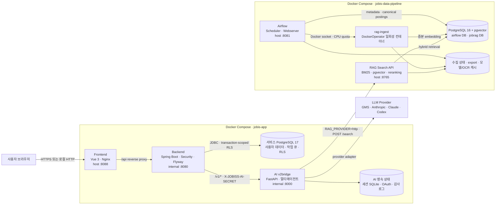
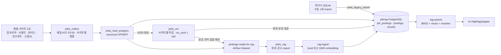

# JOBISS

JOBISS는 사용자의 대화, 이력서·프로젝트·경력 자료, 목표 채용 공고를 하나의 커리어 데이터로 연결하고 AI 분석과 서버 검증을 거쳐 실행 가능한 취업 로드맵으로 만드는 웹 서비스입니다.

AI는 공고와 사용자 자료에서 역량·경력 조건·프로젝트 후보를 제안하지만, 사용자 데이터의 소유권, 지원 가능성 판정, 표준 역량 식별, 로드맵 병합과 공개 여부는 Spring 백엔드가 최종 결정합니다. 채용 공고 수집·OCR·임베딩·검색은 애플리케이션과 분리된 Airflow/RAG 데이터 파이프라인이 담당합니다.

## 핵심 기능

- 자유 대화와 비동기 AI 답변
- 이력서·프로젝트·경력 자료의 AI 파편화 및 사용자 확정
- 채용 공고 저장, 검색, 분석, 보관과 재시도
- 공고별 필수·우대 역량과 경력 조건을 반영한 지원 판단
- 여러 목표 공고를 하나의 직무별 버전형 커리어 로드맵으로 통합
- 개념·코드·상황 문제를 이용한 역량 검증과 프로젝트 증빙 검토
- 실제 정규화 공고 카탈로그 기반 대체 공고 추천
- 채용 사이트 수집, 이미지 공고 OCR, pgvector 기반 하이브리드 RAG 검색

## 전체 아키텍처

로컬 Docker 환경은 역할과 데이터 수명주기가 다른 두 Compose 프로젝트로 분리됩니다.

| Compose 프로젝트 | 정의 파일 | 역할 | 호스트 진입점 |
|---|---|---|---|
| `jobis-app` | `compose.yaml` | Frontend, Backend, AI, 서비스 PostgreSQL | `http://localhost:8088` |
| `jobis-data-pipeline` | `infra/airflow/docker-compose.yml` | Airflow, 수집/OCR, RAG 적재·검색, pgvector | Airflow `:8081`, RAG `:8765` |



로컬에서 두 Compose 네트워크는 분리되어 있으므로 AI는 `host.docker.internal:8765`를 통해 RAG 검색 서버를 호출합니다. 운영에서는 호스트 PostgreSQL·Nginx·Airflow/RAG의 loopback 계약을 유지하기 위해 애플리케이션 컨테이너가 `network_mode: host`를 사용합니다.

### 요청 라우팅과 API 경계

브라우저가 직접 호출하는 서버는 Frontend의 Nginx뿐입니다.

1. 브라우저가 `/api/*`를 호출하면 Nginx가 Spring Backend로 프록시합니다.
2. Backend는 인증 쿠키와 CSRF를 검증하고 트랜잭션에 사용자 UUID를 설정합니다.
3. 사용자 데이터는 PostgreSQL RLS를 통과해 저장·조회됩니다.
4. AI가 필요한 작업은 먼저 DB 큐에 저장한 뒤 Backend 워커가 AI v2bridge를 내부 공유 비밀과 함께 호출합니다.
5. AI는 선택된 LLM provider를 호출하며, 공고 검색이 필요하면 AI 내부의 `HttpRagAdapter`가 RAG 서버의 `POST /search`를 호출합니다.
6. AI 응답은 제안으로 취급되고 Backend가 계약, 역량 정체성, 경력 조건, 지원 판정과 허용 가능한 로드맵 구조를 다시 검증합니다.
7. 작업 결과와 알림이 DB에 저장되면 Frontend가 상태를 갱신합니다.

주요 내부 계약은 다음과 같습니다.

| 호출자 | 대상 | 계약 |
|---|---|---|
| Browser | Frontend/Backend | `/api/auth`, `/api/conversations`, `/api/job-postings`, `/api/analysis-jobs`, `/api/roadmap` 등 |
| Backend | AI v2bridge | `/v1/chat/stream`, `/v1/analyses/stream`, `/v1/career-extractions`, `/v1/evidence-verifications`, 역량 평가 계약 |
| AI v2bridge | RAG Search | `POST /search`, `GET /health` |
| Airflow/RAG ingest | jobrag PostgreSQL | `job_postings`, `postings`, `chunks`, `rag_index_metadata` |

따라서 기본 라우팅은 **Frontend → Backend → AI → RAG**입니다. Backend가 RAG 서버를 직접 호출하지는 않습니다. 또한 `GET /api/job-postings/{postingId}/alternatives`는 RAG 결과가 아니라 서비스 PostgreSQL의 정규화된 `posting_catalog`를 사용합니다.

### 비동기 애플리케이션 흐름

대화 답변, 공고 분석, 커리어 자료 파편화, 역량 평가와 증빙 검토는 HTTP 요청 안에서 끝날 때까지 기다리지 않습니다.

```text
요청 저장 → DB 작업 큐 등록 → 즉시 응답 → Backend 워커 점유
        → AI v2bridge 호출 → 서버 측 계약 검증 → 결과/알림 저장 → UI 갱신
```

- 사용자 메시지와 원본 자료는 AI 호출 전에 저장되므로 외부 provider가 실패해도 보존됩니다.
- 공고 분석 스트림은 NDJSON 이벤트로 진행 단계를 전달하며, 스트림 경로가 404/405일 때만 단건 API로 폴백합니다.
- 모호한 조건이 있으면 작업은 `WAITING_FOR_INPUT`이 되고, 사용자가 선택지에 답하면 같은 작업이 다시 `QUEUED`로 돌아갑니다.
- 재진입 가능한 큐와 중복 방지 키를 사용해 재시도 시 같은 사용자 작업이 중복 반영되지 않도록 합니다.

## 데이터 수집과 RAG 파이프라인

Airflow는 다섯 채용 사이트의 원본 수집부터 OCR, canonical PostgreSQL 적재, RAG 인덱스 갱신까지를 Dataset 이벤트로 연결합니다.



- `jobis_collect`만 정기 스케줄을 가지며 후속 DAG는 Dataset 이벤트로 실행됩니다.
- 이미지형 공고는 PostgreSQL 행을 선점한 뒤 PaddleOCR로 본문을 보강합니다. OCR은 모델 자원 사용량 때문에 기본적으로 한 작업씩 실행합니다.
- `rag-ingest`는 Airflow Scheduler가 Docker socket을 통해 만드는 임시 컨테이너이며 Compose의 고정 서비스가 아닙니다.
- 기본 로컬 임베딩은 `BAAI/bge-m3`, 리랭커는 `BAAI/bge-reranker-v2-m3`입니다. 환경변수만으로 임베딩과 리랭킹을 GMS로 전환할 수 있습니다.
- 로컬 적재와 검색은 기본 2 CPU, embedding batch 8, ingest window 64, rerank batch 4로 제한됩니다.
- 인덱스에는 임베딩 provider·모델·차원을 함께 기록합니다. 설정이 다르면 검색 서버 기동을 거부해 서로 다른 벡터 공간이 섞이지 않도록 합니다.
- 새 인덱스는 전체 embedding과 DB 저장이 성공한 뒤 원자적으로 공개됩니다. 적재 중에는 직전에 성공한 인덱스로 계속 검색합니다.

## 데이터와 신뢰 경계

두 PostgreSQL은 목적이 다르며 서로 대체하지 않습니다.

| 저장소 | 정본 데이터 | 접근 주체 |
|---|---|---|
| 서비스 PostgreSQL 17 | 사용자, 인증, 대화, 작업 큐, 분석, 커리어 조각, 역량, 로드맵, 공고 카탈로그 | Backend만 접근, 앱 역할에 RLS 적용 |
| jobrag PostgreSQL 16/pgvector | 수집 원본, OCR 상태, 검색용 공고·청크·벡터, Airflow 메타데이터 | Airflow, rag-ingest, rag-search |
| AI 상태 볼륨 | 세션 SQLite, Codex OAuth, 감사 로그 | AI v2bridge |
| 파이프라인 볼륨 | 크롤 상태/export, Hugging Face·PaddleOCR 캐시 | Airflow와 RAG 작업 |

보안 원칙:

- 브라우저가 보낸 사용자 ID는 소유권 근거로 사용하지 않고 HttpOnly 인증 쿠키만 신뢰합니다.
- 변경 요청은 CSRF 검증을 거치며 각 응답과 로그에는 요청 ID가 연결됩니다.
- Backend의 Flyway 마이그레이션 역할과 RLS가 적용되는 앱 역할을 분리합니다.
- AI 서버에는 서비스 DB 자격 증명이 없고 Backend와 AI 사이에는 공유 비밀 헤더가 필요합니다.
- AI 출력은 데이터 제안이며, DB 변경과 로드맵 공개는 Backend 검증과 사용자 승인 후 수행합니다.
- Docker 이미지와 volume은 DB 백업이 아닙니다. PostgreSQL custom-format 논리 덤프와 격리 복구 훈련을 사용합니다.

## 기술 스택

| 영역 | 주요 기술 |
|---|---|
| Frontend | Vue 3, TypeScript, Vite 7, Vue Router, Nginx |
| Backend | Java 17, Spring Boot 4, Spring Security, Spring JDBC, Flyway, Testcontainers |
| AI | Python 3.11, FastAPI, Pydantic 2, LangGraph/LangChain, GMS·Anthropic·Claude·Codex adapters |
| RAG | BGE-M3, BGE reranker, OpenAI-compatible GMS API, BM25, pgvector, FastAPI |
| Data pipeline | Apache Airflow, DockerOperator, PaddleOCR, PostgreSQL 16/pgvector |
| Runtime/Delivery | Docker Compose, Jenkins, GitLab MR, Nginx, systemd 운영 도구 |

## 저장소 구조

```text
.
├─ frontend/              Vue 사용자 화면과 Nginx 프록시
├─ backend/               Spring API, 보안, RLS 문맥, 작업 큐와 도메인 규칙
├─ AI/                    FastAPI v2bridge, 멀티에이전트와 LLM/RAG adapters
├─ RAG/                   공고 chunking, embedding, hybrid search와 reranking
├─ DATA/                  사이트별 수집, 정규화, OCR/export 코드
├─ infra/
│  ├─ airflow/            Airflow DAG, pgvector Compose, Flyway, 백업/복구
│  └─ postgres/           서비스 PostgreSQL 초기화
├─ ops/                   운영 Compose, Jenkins 배포, 백업·복구·감사·롤백 도구
├─ docs/                  상세 아키텍처와 API/운영 계약
├─ scripts/               로컬 검증과 개발 보조 스크립트
├─ compose.yaml           jobis-app 로컬 Compose
├─ RUN.md                 전체 로컬 실행 절차의 정본
└─ Jenkinsfile            CI/CD 파이프라인
```

`ai-server/`와 `fake-ai/`는 현재 활성 배포 경로가 아닙니다. 실제 Backend의 AI 계약 진입점은 `AI/src/jobis_ai/v2bridge/app.py`입니다.

## 실행 방법

환경변수 생성, 두 Compose의 빌드·기동 순서, Codex OAuth, Airflow DAG 실행, RAG 테스트, 로그 확인과 종료 방법은 **[RUN.md](RUN.md)**에 정리되어 있습니다. 이 README는 구조와 책임을 설명하고, 실행 명령의 정본은 `RUN.md`로 유지합니다.

기동 후 기본 접속 지점:

| 기능 | 주소 |
|---|---|
| JOBISS 웹 | `http://localhost:8088` |
| Backend health | `http://localhost:8088/api/health` |
| Airflow UI | `http://localhost:8081` |
| RAG health | `http://localhost:8765/health` |
| RAG search | `POST http://localhost:8765/search` |

실행 전에 루트 `.env`와 `infra/airflow/.env`를 각각 준비해야 합니다. 두 환경 파일은 서비스 인증/사용자 DB와 데이터 파이프라인 DB·모델 설정이라는 서로 다른 비밀 및 수명주기를 가지므로 분리되어 있습니다. 실제 비밀값은 출력하거나 커밋하지 않습니다.

## CI/CD와 운영 배포

```text
기능 브랜치/MR → 전체 CI
develop         → 전체 CI + 세 애플리케이션 이미지 빌드 검증, 배포 없음
master          → 전체 CI → SHA 이미지 → 서버 사전 감사 → DB 백업 → 자동 배포
                                      └ 실패 시 직전 SHA 이미지로 롤백
```

- CI는 Backend/PostgreSQL 테스트, AI 테스트, Frontend typecheck/build, RAG 테스트, 운영 스크립트와 Compose 검증을 수행합니다.
- 배포 산출물은 `jobis-ai:<SHA>`, `jobis-backend:<SHA>`, `jobis-frontend:<SHA>` 세 불변 이미지입니다.
- 운영 배포 전에 DB 논리 백업과 복구 가능성을 확인하고, 배포 뒤 AI → Backend → Frontend 순서로 health/smoke test를 수행합니다.
- Airflow/RAG DB는 애플리케이션 DB와 별도의 백업·복구 절차를 따릅니다.
- 레거시 프로세스와 이미지는 신규 컨테이너 릴리스 및 롤백 훈련이 검증된 뒤에만 정리합니다.

자세한 배포 및 복구 절차는 [운영 배포 런북](ops/DEPLOYMENT.md)과 [Airflow/jobrag 백업·복구](infra/airflow/BACKUP_RESTORE.md)를 따릅니다.

## 상세 문서

- [실행 가이드](RUN.md)
- [서비스 아키텍처와 도메인 불변 조건](docs/architecture.md)
- [Backend API 계약](docs/api-contract.md)
- [AI 에이전트 연동 계약](docs/ai-agent-integration.md)
- [운영 가이드](docs/operations.md)
- [Airflow/RAG 파이프라인](infra/airflow/README.md)
- [배포·백업·롤백 런북](ops/DEPLOYMENT.md)
