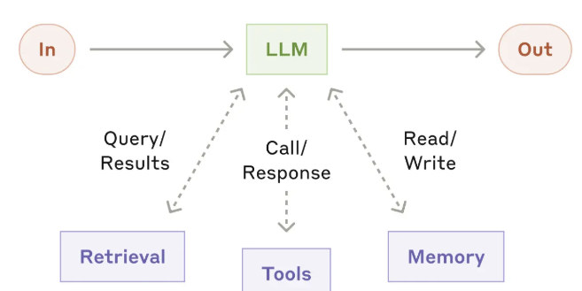

# AI Agent 설계 가이드 - 프로젝트 참고 자료

## Tool 갯수
- Agent 당 2~5개, 많아도 10개를 넘지 않음 → Tool이 많아질수록 판단 성능이 떨어진다고 함

## AI Agent 만들기 위해서 가장 우선시해야 하는 것들
- 문제 정의
- 사용자 시나리오 → 사용자가 어떤 상황에서 어떤 목적으로 어떤 결과를 기대하는가?에 대한 출발지와 목적지

### 사용자 시나리오란?
- 고정된 실행 경로를 짜는 것이 아님
- 사용자의 페르소나, 입력 데이터(시작점), 에이전트에게 기대하는 최종 결과물(목적지)을 한 문장 혹은 한 단락의 스토리로 정의하는 것
- **예시:** "사용자가 화상회의 텍스트 로그를 입력하면, 에이전트가 주요 액션 아이템을 추출하여 담당자별 Jira 티켓 생성 API를 호출하고 결과를 요약해 준다."

- **잘못된 접근:** "사용자가 무작위로 요청하면 에이전트가 알아서 해결한다." (범위가 너무 넓어 프롬프팅과 툴 스키마 설계가 불가능함)

- **사용자 시나리오 예시:** "인사담당자(사용자)가 채용 공고 링크와 지원자 이력서 10개를 던져주며, 공고에 가장 적합한 순서대로 후보자를 추려 보고서(md)로 만들어 달라고 요청한다."

> 자율적으로 움직이는 에이전트일수록, **"무슨 문제를 해결하기 위해 어떤 상황에서 쓰이는가"**라는 경계선(시나리오)이 명확해야 LLM의 판단 흐림이나 무한 루프 같은 실패를 막을 수 있습니다.

- Tool 명세
- 정상 흐름
- 예외 흐름
- 종료 조건
- 성공 판단 기준

## Agent vs Workflow
- 경로가 고정이면 Workflow로 충분합니다.
- 경로가 상황마다 달라져야 하면 Agent가 맞습니다.

## Anthropic이 제시한 AI Agent 설계 원칙 세 가지

1. **Selective use** — 필요할 때만 Agent를 씁니다.
   - 경로를 그릴 수 있으면 Workflow로 시도해봅니다.
2. **Simplicity** — 가장 단순한 구조부터 시작합니다.
   - Multi Agent는 지양합니다.
3. **Agent's perspective** — 디버깅은 "LLM이 보는 컨텍스트와 tool 설명"을 보는 것
   - 사람이 볼 때 자연스러운 설명이 LLM에게는 어려울 수 있습니다.

### 위 세 원칙 기반으로 아래 내용들을 설정함
- 어떤 tool을 몇 개 제공하고, 각 tool의 설명을 어떻게 쓸지
- System prompt에 역할·제약·종료 조건을 어떻게 담을지
- 대화 이력과 장기 기억을 어떻게 나눌지 (Memory)
- 언제 멈추게 할지 (Max iteration, Time budget, Token budget)
- 위험한 행동 앞에 사람을 개입할지 (Human-in-the-loop)
- 입력·출력·tool 호출, 데이터를 어떻게 보호할지 (Guardrails, Authenticate and authorize)
- 실패를 어떻게 관측하고 재현할지 (Observability)
- 이 전체를 어느 프레임워크 위에 얹을지 (실시간성, 배치성, 이벤트성)

## AI Agent 4대 구성요소



- **LLM** — 추론. 다음 행동을 결정
- **Planning** — 계획. 목표를 하위 태스크로 분해
- **Tool** — 행동. 외부 세계와의 접점
- **Memory** — 상태. 단기(Short Term - 대화 이력, 컨텍스트), 장기(Long Term - 사실·벡터 저장소)

### 각 축이 빠지면 실패 모양이 다르게 드러남

| 빠지는 축 | 드러나는 증상 |
|---|---|
| LLM 판단 흐림 | 엉뚱한 tool 선택, 같은 질문에 다른 경로 |
| Tool 스키마 불명확 | hallucinated tool call, 없는 파라미터 호출 |
| Memory 없음 | 대화 맥락 유실, 이전 결과 반복, 상태 유실 |
| Planning 없음 | 무한 루프, 중도 방향 상실 |

## 4가지 구성 요소를 실제 AI 개발과 매칭

### System prompt
Agent의 목표·제약·행동 가이드로 LLM, Planning 구성을 포함합니다.
- 역할과 목표 — 이 Agent가 달성해야 하는 것
- 제약 — 하지 말아야 할 것, 정책, 톤
- 사용 가능한 도구와 선호 순서 — 각 tool을 언제 쓰는지에 대한 힌트
- 종료 조건 — 언제 "done"이라고 선언할 것인가

### Context, Database
Agent가 장기, 반복 실행 가능하게 결과를 저장하고 상태를 기록하는 구성입니다.
- 단기 메모리 → 이전 입/출력을 다음 AI 입력으로 넣음
  - compression, 최근 N개의 턴만 자르기
- 장기 메모리 → Redis Vector Search, Vector 검색이 가능한 데이터베이스, 혹은 파일 자체
  - [Context Engineering for AI Agents - Lessons from Building Manus](https://manus.im/ko/blog/Context-Engineering-for-AI-Agents-Lessons-from-Building-Manus)

### Tool
코드, 함수 그 자체를 의미 → 이름, 설명, 파라미터(입력), 반환 스키마(출력)
- LLM이 tool의 내부 구현을 보지 않고 함수에 필요한 입력을 넣고 실행하는 것
  - 정확히 말하면 Tool은 AI가 직접 코드를 실행하는 것이 아닙니다.
  - AI가 "어떤 함수를 어떤 인자로 호출할지"를 결정, 프레임워크 런타임이 해당 Python 함수 실행
- 프레임워크에서 Thought / Action / Observation을 단순 state로 구현한 것 뿐

```python
state = initial_state

while not framework.should_stop(state):
    state = agent.invoke(state)

return state
```

### MCP & Tool 참고
- 지금까지 tool은 각 프레임워크가 정의한 함수 스키마
  - LangChain의 Tool 객체, OpenAI function calling, AutoGen의 tool 인터페이스가 전부 다름
  - Agent를 A 프레임워크에서 B 프레임워크로 옮기려면 tool 연결부를 전부 다시 짜야 하는 번거로움
  - MCP(Model Context Protocol)는 이 문제를 해결하며 쉬운 통합을 제공